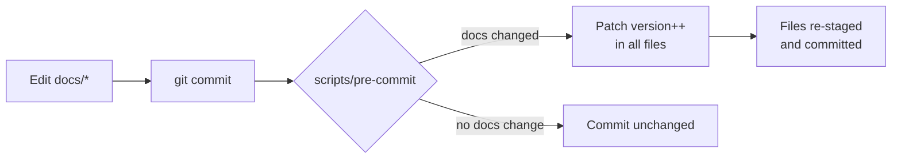

# Contributing to GRQ FX Validation Dashboard

Thanks for your interest in improving the GRQ FX Validation Dashboard — a
JAMstack Progressive Web App that validates AI FX predictions against actual
rates over time. This guide collects everything you need to set up the
toolchain, run the quality gate, follow the version-bump workflow and open a
pull request. It consolidates knowledge that was previously scattered across
[`README.md`](README.md), [`SETUP_SUMMARY.md`](SETUP_SUMMARY.md) and
[`VERSION_SYSTEM.md`](VERSION_SYSTEM.md).

## Code of conduct

Be respectful and constructive. We follow the spirit of the
[Open Source Guides](https://opensource.guide/) — assume good intent, keep
feedback specific, and focus on the change rather than the contributor.

## Toolchain

The project ships as a static site with **no build step**, but the test and
quality tooling needs two runtimes:

- **[Deno](https://deno.com/)** (v2.x) — runs the local dev server
  (`helpers/server.ts`) and the TypeScript test suite (`tests/*.test.ts`).
- **[Node.js](https://nodejs.org/)** (v20+) — runs the JavaScript test suite
  (`tests/*.test.js`) via the built-in `node --test` runner.

No `npm install` is required: the Node tests rely only on the standard library
(`node:test`, `node:assert`), and Deno fetches and integrity-pins its imports
through `deno.lock`.

## Getting started

1. **Fork and clone** the repository.
2. **Install the git hooks** so your commits get an automatic version bump:

   ```bash
   ./setup-hooks.sh
   ```

3. **Run the local dev server** to preview the dashboard:

   ```bash
   helpers/server.sh
   ```

   This serves the `docs/` directory over loopback using the Deno
   implementation in `helpers/server.ts`.

## Running the quality gate

Always run the full quality gate before opening a pull request. The same
script runs in CI and must pass before a deploy job will publish to GitHub
Pages:

```bash
./quality.sh < /dev/null
```

The gate runs:

- the **Node.js** test suite — `node --test tests/*.test.js`, and
- the **Deno** test suite — `deno test --frozen --allow-read
  --allow-net=127.0.0.1 tests/*.test.ts`.

Redirect stdin from `/dev/null` (`< /dev/null`) so the run never blocks waiting
for input. CI additionally runs Markdown lint, ShellCheck, Gitleaks, Semgrep,
`dependency-review`, a `pa11y-ci` accessibility check and a Deno dependency
audit — see the **Quality Gate** section of [`README.md`](README.md) for the
full list.

### Writing tests

- Put Node tests in `tests/*.test.js` and Deno tests in `tests/*.test.ts`.
- Tests must call real functions with test data and assert on the result
  (return value, exit code or side effect). Do **not** grep source text.
- Cover the happy path, at least one error path and the relevant edge cases.

## The version-bump workflow

The dashboard is a PWA, so cached clients only pick up new assets when the
`VERSION` string changes. A `scripts/pre-commit` git hook handles this for you:
whenever a commit touches the `docs/` directory it auto-increments the patch
version and keeps every version reference (the `VERSION` constant in
`docs/index.js`, the cache-bust query strings and version span in
`docs/index.html`, the `sw.js?v=` string in `docs/sw-register.js` and the
`grq-fx-*` cache names in `docs/sw.js`) in lock-step.



Install the hook once with `./setup-hooks.sh`. Because the hook only runs for
contributors who have installed it, a fail-only CI **version-guard** job
re-checks consistency and bump-on-change on every pull request. See
[`VERSION_SYSTEM.md`](VERSION_SYSTEM.md) for the full details.

If you ever need to bump manually, edit the `VERSION` constant in
`docs/index.js` and update the matching references in `docs/index.html`,
`docs/sw.js` and `docs/sw-register.js` so they all agree.

## Pull request workflow

1. **Branch off `Develop`** — `Develop` is the default branch and the base for
   all pull requests.
2. Make focused changes with clear commit messages that reference the relevant
   issue (e.g. `Add CHANGELOG.md (issue #79)`).
3. Add or update tests and a `## [Unreleased]` entry in
   [`CHANGELOG.md`](CHANGELOG.md) describing your change.
4. Run `./quality.sh < /dev/null` and make sure it passes cleanly.
5. **Open a pull request against `Develop`** and fill in what changed and why.
6. Address review feedback; once CI is green and the change is approved it will
   be merged and deployed to GitHub Pages.

## Style

- Use **Australian English** spelling in code, comments and documentation
  (colour, behaviour, organisation, favour, centre).
- Keep Markdown lint-clean against `.markdownlint-cli2.jsonc`.
- Prefer small, focused files and changes.

Thanks for contributing!
