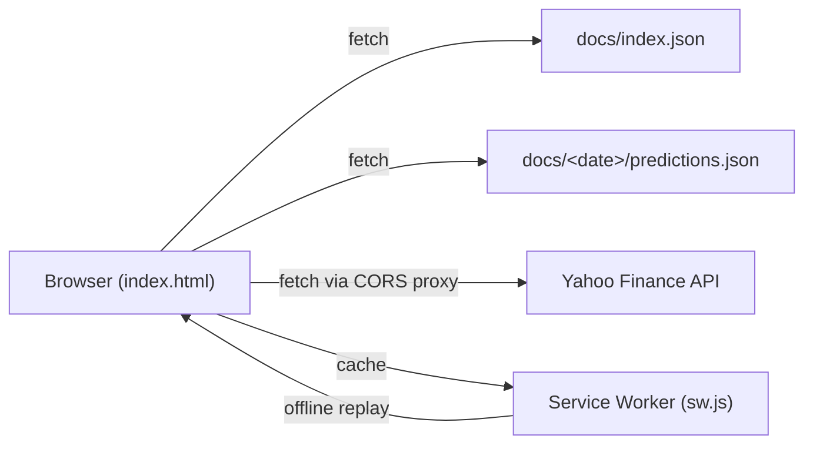

# GRQ FX Validation Dashboard

A JAMstack-based Progressive Web App (PWA) for validating AI FX predictions
against actual rates over time.

## Architecture

This project follows JAMstack principles and ships as a static site that runs
entirely in the browser — no build step, no server-side code.

- **JavaScript**: Client-side modules (`docs/index.js`, `docs/safe-card.js`,
  `docs/safe-error-banner.js`, `docs/yahoo-validate.js`) drive the dashboard.
- **APIs**: Static JSON files (`docs/index.json`, `docs/<date>/predictions.json`)
  are served as the data API. Yahoo Finance is consulted at runtime via a
  small allowlist of public CORS proxies.
- **Markup**: A single pre-built HTML file (`docs/index.html`) is served
  statically by GitHub Pages.



## Features

- **FX Prediction Validation**: Compare AI predictions with actual FX rates.
- **Time Horizon Analysis**: Monthly (30d), Quarterly (90d), Half-Year (180d)
  and Full-Year (365d) predictions.
- **Performance Metrics**: Accuracy, error rates and summary statistics
  computed client-side.
- **Interactive Charts**: Predicted-vs-actual visualisation using Chart.js with
  the `chartjs-adapter-date-fns` time-scale adapter.
- **Yahoo Finance Validation**: Cross-checks CSV data against Yahoo Finance
  historical ranges via a multi-proxy fallback (see
  [`YAHOO_FINANCE_INTEGRATION.md`](YAHOO_FINANCE_INTEGRATION.md) and
  [`ENHANCED_YAHOO_FINANCE.md`](ENHANCED_YAHOO_FINANCE.md)).
- **Pending Actual Rates**: Handles future-dated predictions that have no
  actual rate yet.
- **Date and Performance Filtering**: Browse predictions by date and accuracy.
- **Dark Mode**: Built-in light/dark toggle that persists across sessions.
- **Progressive Web App**: Installable with offline support via a service
  worker (`docs/sw.js`) and `docs/manifest.json`
  (see [`docs/PWA_SETUP_GUIDE.md`](docs/PWA_SETUP_GUIDE.md)).
- **Hardened Front-End**: Content-Security-Policy meta tag, Subresource
  Integrity (SRI) pins on all CDN scripts, and Yahoo-response schema
  validation defend against XSS and malicious proxy injection (issues #13,
  #23, #24).
- **Responsive Design**: Works on desktop and mobile devices.

## Time Horizons

The dashboard focuses on four key prediction timeframes:

| Period    | Days | Description             |
| --------- | ---- | ----------------------- |
| Monthly   | 30   | One-month predictions   |
| Quarterly | 90   | Three-month predictions |
| Half-Year | 180  | Six-month predictions   |
| Full-Year | 365  | One-year predictions    |

## Data Availability

- **Historical Rates**: 12 months of historical data available from prediction
  date.
- **Actual Rates**: Updated as they become available over time.
- **Pending Status**: Shows "Pending" for future dates where actual rates
  aren't available yet.

## File Structure

```
.
├── README.md                # This file
├── quality.sh               # Quality gate (runs in CI)
├── setup-hooks.sh           # Installs the version-bump git hook
├── .github/workflows/       # CI workflows (lint, tests, security scans)
├── helpers/                 # Local dev server (Deno + Bash)
├── scripts/pre-commit       # Auto-increments the patch version on docs changes
├── tests/                   # Node.js (*.test.js) and Deno (*.test.ts) suites
└── docs/                    # The published site (GitHub Pages root)
    ├── index.html           # Main dashboard
    ├── index.js             # Dashboard logic + VERSION constant
    ├── index.json           # Index of available prediction dates
    ├── manifest.json        # PWA manifest
    ├── sw.js                # Service worker (offline cache)
    ├── sw-register.js       # Service-worker registration shim
    ├── safe-card.js         # XSS-safe FX card renderer (issue #23)
    ├── safe-error-banner.js # XSS-safe error banner (issue #23)
    ├── yahoo-validate.js    # Yahoo Finance response schema validator
    ├── styles.css           # Stylesheet
    ├── browserconfig.xml    # Windows tile metadata
    ├── icons/               # PWA icon set (16×16 → 512×512)
    ├── data/                # Shared current actual-rate CSVs by pair
    ├── evidence/            # Screenshots captured for PR evidence
    ├── PWA_SETUP_GUIDE.md   # PWA setup notes
    ├── ICON_SPECIFICATIONS.md
    └── <YYYY-MM-DD>/        # One directory per prediction date
        ├── predictions.json # FX predictions captured on that date
        └── *.csv            # Actual rates per currency pair
```

Each prediction date directory under `docs/` (for example
`docs/2025-07-27/`) contains a `predictions.json` plus per-pair CSV files
that accrue as the actual rates become observable. Shared "current"
actual-rate CSVs that are not tied to a single prediction date live under
`docs/data/` and are referenced by the Yahoo Finance validation module.

## Data Format

### index.json

```json
{
  "entries": {
    "2025-07-27": {
      "date": "2025-07-27",
      "type": "fx_predictions",
      "description": "FX predictions for 2025-07-27",
      "file": "2025-07-27/predictions.json"
    }
  }
}
```

### predictions.json

```json
{
  "date": "2025-07-27",
  "results": [
    {
      "pair": "AUDCAD",
      "currentRate": 0.9123,
      "predictions": [
        { "days": 30, "predictedRate": 0.9150, "predictedChangePercent": 0.3 },
        { "days": 90, "predictedRate": 0.9200, "predictedChangePercent": 0.8 },
        { "days": 180, "predictedRate": 0.9250, "predictedChangePercent": 1.4 },
        { "days": 365, "predictedRate": 0.9300, "predictedChangePercent": 1.9 }
      ]
    }
  ]
}
```

## Usage

1. **View Dashboard**: Open `docs/index.html` in a web browser, or visit the
   deployed GitHub Pages URL.
2. **Select Date**: Choose a prediction date from the dropdown.
3. **View Performance**: See charts and tables showing prediction accuracy.
4. **Monitor Progress**: Track which actual rates are available vs pending.
5. **Toggle Dark Mode**: Use the moon/sun button in the header to switch
   themes; the preference is persisted in `localStorage`.

For local development with a one-line static server, run:

```bash
helpers/server.sh
```

(See `helpers/server.ts` for the Deno implementation used by the script.)

## Performance Metrics

The dashboard calculates several key metrics:

- **Total Pairs**: Number of FX pairs analysed.
- **Available Actuals**: Count of actual rates available vs total possible.
- **Average Error**: Mean prediction error across available time horizons.
- **Best Performer**: FX pair with the lowest average error.

## Deployment

This is a static site that can be deployed to any web server or CDN. The
canonical deployment target is **GitHub Pages**: the `docs/` directory is
served directly and `.github/workflows/ci.yml` publishes a new build on each
green push to the default branch.

Alternative targets:

- **Netlify** — drag and drop the `docs` folder.
- **Vercel** — connect the repository.
- **AWS S3** — upload `docs/` to a bucket with static website hosting.

## Adding New Prediction Data

1. Create a new directory in `docs/` named after the prediction date
   (e.g. `docs/2025-08-01/`).
2. Add `predictions.json` containing entries for the four time horizons
   (30/90/180/365 days).
3. Add per-pair CSV files for actual rates as they become available.
4. Update `docs/index.json` to register the new entry.
5. Commit the change; the `scripts/pre-commit` hook auto-increments the
   patch version recorded in `docs/index.js` so cached clients pick up the
   new data on next load (see [`VERSION_SYSTEM.md`](VERSION_SYSTEM.md)).

### Troubleshooting: today's date not selectable

If you've added a new dated folder (for example `docs/2025-12-31/`) but it
**doesn't appear in the date dropdown**, the most common cause is a stale
cached `docs/index.json` (often via the PWA / service-worker cache).

- **Check the index**: confirm `docs/index.json` includes the new date entry.
- **Clear the site cache** (Chrome): DevTools → Application → Clear storage →
  "Clear site data", then reload.
- **Unregister the service worker** (Chrome): DevTools → Application →
  Service Workers → "Unregister", then reload.

### Troubleshooting: a specific horizon shows N/A (for example Quarter/90d)

If `predictions.json` has a value (for example `days: 90`) but the dashboard
shows **N/A**, the most common cause is stale PWA / service-worker cached
data.

- **Confirm the version**: ensure the footer shows the current version
  string (or newer) defined in `docs/index.js`.
- **Hard refresh**: reload the page with a hard refresh.
- **Clear the site cache** (Chrome): DevTools → Application → Clear storage →
  "Clear site data", then reload.
- **Unregister the service worker** (Chrome): DevTools → Application →
  Service Workers → "Unregister", then reload.

You can run the regression guard for the dropdown freshness locally:

```bash
node --test tests/pwa-index-freshness.test.js
```

## Quality Gate

Run the full quality gate before raising a PR. The same script runs in CI
(see `.github/workflows/ci.yml`) and must pass before a deploy job will
publish to GitHub Pages — issue #30 added this gate after a regression that
the existing tests should have caught was deployed.

```bash
./quality.sh < /dev/null
```

The gate runs the Node.js test suite (`tests/*.test.js`) and the Deno test
suite (`tests/*.test.ts`). One of the guards is a deploy-time consistency
check that every entry in `docs/index.json` resolves to a non-empty,
parseable `predictions.json` — exactly the failure mode that produced the
"Failed to load prediction data" screen.

CI additionally runs Markdown lint (`.github/workflows/markdown-lint.yml`),
ShellCheck (`.github/workflows/shellcheck.yml`), Gitleaks
(`.github/workflows/gitleaks.yml`), Semgrep SAST
(`.github/workflows/semgrep.yml`) and `actions/dependency-review`
(`.github/workflows/dependency-review.yml`).

## Browser Compatibility

- Chrome 60+
- Firefox 55+
- Safari 12+
- Edge 79+

## Dependencies

All client-side dependencies are loaded from `cdn.jsdelivr.net` with
SHA-384 Subresource Integrity (SRI) pins (issue #13). The current pinned
set is:

- Bootstrap 5.3.3
- Chart.js 4.5.0
- `chartjs-adapter-date-fns` 3.0.0

No build process or server-side code is required.

## Dependency Update Quarantine

External (non-`stSoftwareAU/*`) dependencies are held back for at least
**24 hours** after publication before they are eligible for a bump. The
delay gives the wider ecosystem time to flag a malicious release before it
can be merged here. The gate is enforced by `renovate.json` at the
repository root and covers:

- GitHub Actions referenced from `.github/workflows/*.yml`
- The Deno standard library imported from `helpers/server.ts`
- CDN-loaded browser libraries referenced from `docs/index.html` and
  `docs/sw.js`

Internal `stSoftwareAU/*` packages are exempt and may update immediately.
Regression coverage lives in `tests/renovate-quarantine.test.js` — run it
locally with:

```bash
node --test tests/renovate-quarantine.test.js
```

## Further Reading

The repository also contains a number of standalone notes:

- [`VERSION_SYSTEM.md`](VERSION_SYSTEM.md) — how the auto-incrementing
  patch version works.
- [`YAHOO_FINANCE_INTEGRATION.md`](YAHOO_FINANCE_INTEGRATION.md) and
  [`ENHANCED_YAHOO_FINANCE.md`](ENHANCED_YAHOO_FINANCE.md) — Yahoo Finance
  integration details and CORS proxy strategy.
- [`docs/PWA_SETUP_GUIDE.md`](docs/PWA_SETUP_GUIDE.md) and
  [`docs/ICON_SPECIFICATIONS.md`](docs/ICON_SPECIFICATIONS.md) — PWA
  configuration and icon production notes.

Older "migration" and "refactoring" summaries
([`JAMSTACK_MIGRATION.md`](JAMSTACK_MIGRATION.md),
[`REFACTORING_SUMMARY.md`](REFACTORING_SUMMARY.md),
[`SETUP_SUMMARY.md`](SETUP_SUMMARY.md),
[`JAVASCRIPT_EXTRACTION.md`](JAVASCRIPT_EXTRACTION.md)) are kept for
historical context only — each carries a "Historical document" banner at
the top. Treat this README as the authoritative description of the current
architecture.
