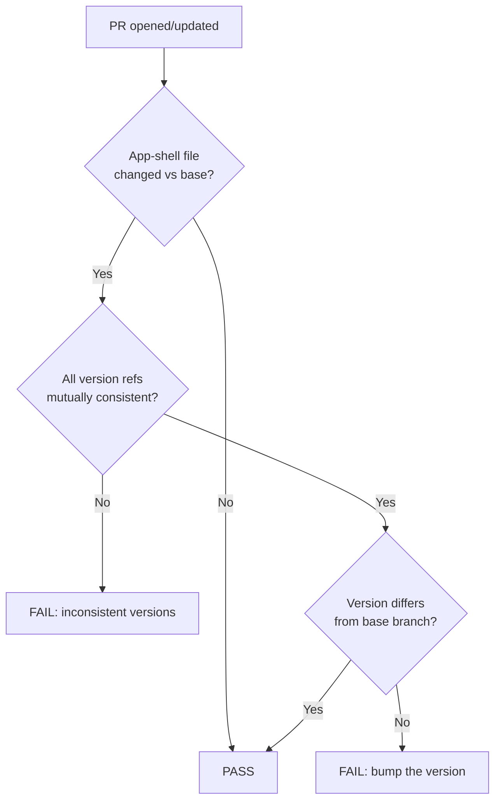

# Version Incrementing System

This project uses an automated version incrementing system similar to the one in GRQ-validation.

## How it Works

1. **Version Variable**: The `VERSION` constant is defined in `docs/index.html` and is used to:
   - Set the page title with version number
   - Display the version at the bottom of the page
   - Force browser cache refresh for JS/CSS files

2. **Git Hook**: A pre-commit hook automatically increments the patch version when any files in the `docs/` directory are committed.

3. **Version Display**: The version is shown at the bottom of the page and updates automatically.

## Files Involved

- `scripts/pre-commit` - Git hook that increments version
- `docs/index.js` - Contains VERSION constant and all JavaScript functionality
- `docs/index.html` - HTML structure with version display
- `setup-hooks.sh` - Script to install git hooks
- `helpers/version_check.ts` - Pure logic behind the CI version-bump guard
- `scripts/check-version-bump.ts` - Fail-only CI wrapper invoked by `ci.yml`

## CI Version-Bump Guard (issue #65)

The pre-commit hook only runs for contributors who have installed it, so an
app-shell change could otherwise be merged without a version bump — leaving
the deployed PWA serving stale cached assets. A **fail-only** CI job
(`version-guard` in `.github/workflows/ci.yml`) closes that gap on every
pull request.

The guard considers a file part of the **app shell** when it is a root-level
`docs/` asset that is cache-busted on deploy: `index.html`, `index.js`,
`sw.js`, `sw-register.js`, `styles.css`, `safe-card.js`,
`safe-error-banner.js`, `yahoo-validate.js`. Dated daily-data directories
(`docs/YYYY-MM-DD/…`) and data/config files are excluded.

It enforces two things:

1. **Consistency** — every version reference must agree: the `VERSION`
   constant in `index.js`, the `?v=` query strings and version span in
   `index.html`, the `sw.js?v=` string in `sw-register.js`, and all
   `grq-fx-*` cache names in `sw.js`. Bumping one without the others fails.
2. **Bump-on-change** — if any app-shell file changed versus the PR base
   branch, the version must differ from the base. If not, the job prints a
   clear remediation message and exits non-zero. It never auto-bumps or
   commits — the developer (or the pre-commit hook) performs the bump.



## Usage

### Initial Setup

```bash
./setup-hooks.sh
```

### Manual Version Update

If you need to manually update the version, edit the VERSION constant in `docs/index.js`:

```javascript
const VERSION = "1.0.1";
```

### Automatic Version Increment

The version will automatically increment when you commit changes to any files in the `docs/` directory:

```bash
git add docs/some-file.html
git commit -m "Update some file"
# Version will automatically increment from 1.0.1 to 1.0.2
```

## Version Format

- Format: `major.minor.patch` (e.g., 1.0.1)
- Only the patch version is auto-incremented
- Major and minor versions must be updated manually if needed

## Browser Cache Busting

The version number is used to force browsers to reload JS/CSS files when the version changes, ensuring users always get the latest version of the application.
