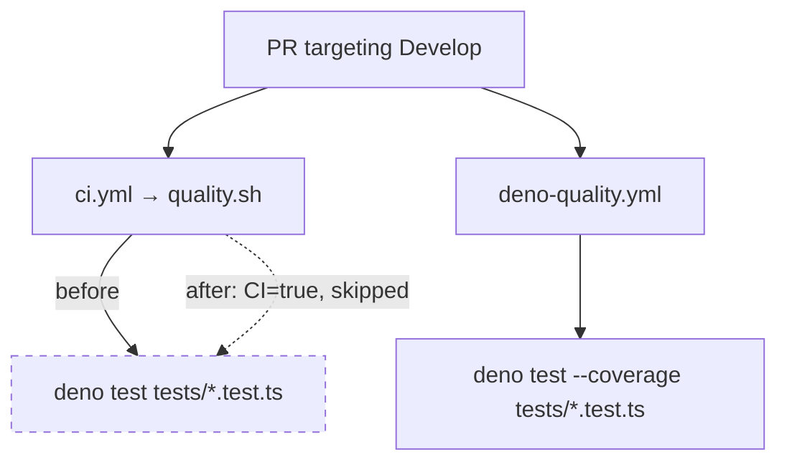

# PR Summary — Issue #104

## Summary

The Deno test suite (`tests/*.test.ts`) was executed twice for every PR
targeting `Develop`: once by `ci.yml` → `quality.sh` and again by
`deno-quality.yml` (the canonical Deno gate, which additionally collects
coverage and uploads to Codecov). This doubled runner minutes for that
suite on every Develop PR and split its source of truth across two files.

`quality.sh` now skips its Deno block when the `CI` environment variable is
set (GitHub Actions exports `CI=true`), leaving `deno-quality.yml` as the
sole Deno-test runner in CI. Contributors running `quality.sh` off-CI still
execute the full Deno suite locally, so it remains a complete local entry
point. The Node suite (`tests/*.test.js`) is unaffected — it was never
duplicated.

Closes #104.

## Evidence

This is a CI/shell change with no web interface to screenshot. Verified via
the new behavioural tests and a clean `quality.sh` run (Deno suite: `69
passed | 0 failed`, then `[quality] All checks passed.`).

Which workflow runs the Deno suite, before and after:

After the change, only `deno-quality.yml` runs the Deno suite in CI; the
`ci.yml` path skips it.

## Test Plan

Added `tests/quality-sh-deno-gate.test.js`, which runs the real `quality.sh`
with stub `node`/`deno` binaries first on `PATH` (fast, no recursion) and
asserts behaviour via invocation markers:

- `quality.sh runs the Deno suite locally (CI unset)` — Deno stub is invoked.
- `quality.sh skips the Deno suite in CI (CI=true)` — Deno stub is **not**
  invoked, while the Node stub still runs.
- `quality.sh explains the CI skip on stdout` — the skip is logged.

Existing tests remain green, including
`tests/deno-lock-integrity.test.js` (`--frozen` is preserved on the Deno
invocation) and the full `quality.sh` gate.
