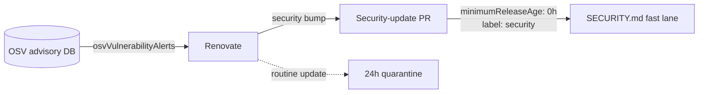

# PR Summary — Issue #110

## Summary

Renovate ran with a 24-hour quarantine and bespoke custom managers for
the `deno.land/std` URL imports and the jsDelivr / cdnjs / unpkg CDN
libraries, but had **no automated security-update channel** for those
dependencies. Renovate's default `vulnerabilityAlerts` is driven by
GitHub's vulnerability-alert API, which never sees Deno URL imports or
CDN `<script>` references — exactly the surface this repo ships. The
mechanism that *does* cover them, `osvVulnerabilityAlerts` (OSV advisory
database, the same source `deno audit` uses), was off.

This change enables OSV-driven security alerting in `renovate.json`:

```jsonc
"osvVulnerabilityAlerts": true,
"vulnerabilityAlerts": {
  "minimumReleaseAge": "0 hours",
  "labels": ["security"]
}
```

`osvVulnerabilityAlerts` makes Renovate raise automated security-update
PRs for the github-releases (`deno_std`) and npm (CDN) datasources the
custom managers already track. The `vulnerabilityAlerts` rule lets a
confirmed security bump skip the 24-hour `minimumReleaseAge` quarantine —
the per-PR override already sanctioned in `SECURITY.md` — and labels it
`security` so maintainers can fast-track it. Every routine update keeps
the 24-hour quarantine. No change to `deno audit`, `deno.lock`, or the
`--frozen` integrity check was needed.

`SECURITY.md` gains a short note documenting this automated channel as
the counterpart to the existing manual emergency-bump fast lane.

Closes #110.

## Evidence

Backend/config change — no web interface to screenshot. Verified via the
test suite and the full quality gate.



`./quality.sh` output:

```
ok | 76 passed | 0 failed
[quality] All checks passed.
```

## Test Plan

Added three regression tests to `tests/renovate-quarantine.test.js`
(they load and assert on the parsed config — they do not grep source
text):

- `renovate.json enables OSV-driven security alerts` — asserts
  `osvVulnerabilityAlerts === true`.
- `renovate.json fast-lanes confirmed security updates past the
  quarantine` — asserts `vulnerabilityAlerts.minimumReleaseAge` parses
  to 0 hours.
- `renovate.json labels security-update PRs` — asserts
  `vulnerabilityAlerts.labels` includes `security`.

All three failed against the pre-change config and pass after it
(12/12 in the file; 76/76 across the suite).
