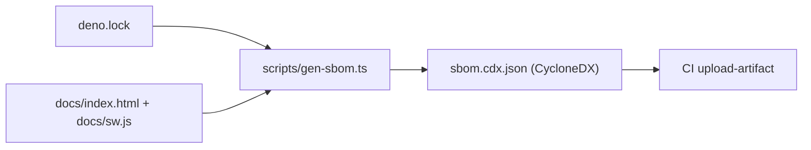

# SCR-SBOM: generate a CycloneDX SBOM for the deployed dashboard

## Summary

The GRQ FX Validation Dashboard is a continuously-deployed PWA, but
neither the repository nor its CI produced a Software Bill of Materials
describing what is shipped to the live GitHub Pages instance. During
supply-chain incident response that left the team reconstructing the
deployed dependency inventory by hand from `deno.lock` and `docs/`.

This change adds a Deno-native SBOM generator and a CI workflow that
publishes the result as a build artefact, turning that reconstruction
into a lookup. **Closes #111.**

- **`scripts/gen-sbom.ts`** — derives a CycloneDX 1.5 SBOM from the two
  real dependency surfaces:
  - the locked Deno tree in `deno.lock` (collapsed to one component per
    `deno.land/std` version), and
  - the CDN browser libraries (Bootstrap, Chart.js, the date-fns adapter)
    referenced from `docs/index.html` and `docs/sw.js`, with each
    Subresource Integrity digest converted to a CycloneDX hex hash.

  Components are sorted by `bom-ref` so regenerating the SBOM yields a
  stable, diff-friendly artefact. Run locally with
  `deno run --allow-read --allow-write scripts/gen-sbom.ts`.
- **`.github/workflows/sbom.yml`** — regenerates the SBOM on every push to
  the default branch, every pull request and a weekly schedule, then
  uploads `sbom.cdx.json` via `actions/upload-artifact`. All actions are
  pinned to 40-character commit SHAs and the job keeps
  `permissions: contents: read` (matches `ci.yml` / `deno-audit.yml`,
  issue #14).
- **`.gitignore`** — ignores the generated `sbom.cdx.json` (a per-build
  artefact, never checked in).
- **`README.md`** — documents the new SBOM section with a Mermaid diagram.

### Deno regression avoided

Implemented the generator as a Deno script (`deno run`) rather than
introducing a Node/Trivy toolchain, keeping the repo Deno-native. No
`package.json`, `node_modules`, or npm tooling was added.

## Evidence

This is a backend/CLI change with no web interface to screenshot. Run
against the real repository, the generator produces the expected
inventory — `deno.land/std@0.208.0` plus the three SRI-pinned CDN
libraries:

```
[gen-sbom] Wrote sbom.cdx.json: 4 components (application 1.0.110).
```



## Test Plan

- **`tests/gen-sbom.test.ts`** (19 Deno tests) — exercises the real
  generator functions with representative inputs: Deno module identity
  parsing, lockfile component collapsing, SRI→hex hash conversion, CDN URL
  identity (jsDelivr/cdnjs/unpkg, scoped packages), tag-aware vs bare-URL
  CDN extraction, hash-preferring dedup, `VERSION` extraction, and a full
  `buildSbom` CycloneDX assembly including deterministic ordering.
- **`tests/sbom-workflow.test.js`** (10 Node tests) — parses `sbom.yml`
  and asserts its structured wiring: triggers, SHA-pinned actions,
  `deno run scripts/gen-sbom.ts` generate step, `upload-artifact` of
  `sbom.cdx.json`, read-only permissions, bounded timeout, concurrency.
- `./quality.sh` passes cleanly (Node + Deno suites); `deno lint`,
  `deno check`, `deno fmt --check` and `markdownlint-cli2` all green.
