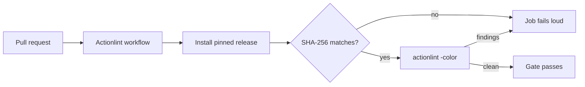

# PR Summary — Issue #119

## Summary

No workflow linted the GitHub Actions YAML itself, so a syntax error, an
invalid `${{ }}` expression or a shell bug inside a `run:` block only surfaced
when a workflow failed at runtime. This adds
`.github/workflows/actionlint.yml`, which installs a pinned
[`actionlint`](https://github.com/rhysd/actionlint) release (SHA-256 verified
before use) and runs `actionlint -color` over `.github/workflows/` on every
pull request. Closes #119.

`actionlint` reports two real SC2086 findings on `Develop` today — `ci.yml`
appends to an unquoted `$GITHUB_OUTPUT` — so those two lines are quoted here,
otherwise the new gate would be red the moment it landed.



## Evidence

Backend/CI change with no web interface to screenshot. Evidence is the linter
itself, run locally at the pinned version (1.7.12, with ShellCheck 0.11.0 on
PATH so `run:` blocks are linted exactly as they are on `ubuntu-latest`).

Red against the current `Develop` tip:

```
$ git archive origin/Develop .github | tar -x -C /tmp/devwf2 && cd /tmp/devwf2
$ actionlint -color
.github/workflows/ci.yml:61:9: shellcheck reported issue in this script:
  SC2086:info:19:23: Double quote to prevent globbing and word splitting
.github/workflows/ci.yml:61:9: shellcheck reported issue in this script:
  SC2086:info:21:24: Double quote to prevent globbing and word splitting
$ echo $?
1
```

Green on this branch:

```
$ actionlint -color
$ echo $?
0
```

The pinned digest was verified against the published release rather than
taken on trust — `actionlint_1.7.12_linux_amd64.tar.gz` in the release's
`checksums.txt` is
`8aca8db96f1b94770f1b0d72b6dddcb1ebb8123cb3712530b08cc387b349a3d8`, which is
the value of `ACTIONLINT_SHA256` in the workflow. 1.7.12 is the current
latest release. `actions/checkout@34e1148` was resolved with
`gh api repos/actions/checkout/git/refs/tags` and is `v4.3.1`, matching the
version comment convention established by #155.

`./quality.sh < /dev/null` passes on this branch (Node suite plus the 95-test
Deno suite).

## Workflow hygiene

The new file satisfies the file-scoped Actions rules in its own right:

- `actions/checkout` is pinned to a 40-character SHA with an accurate
  trailing version comment (`v4.3.1`, per #155).
- The checkout sets `persist-credentials: false` — the job only reads the
  tree, so it has no reason to leave a push-capable token in `.git/config`.
- The `pull_request` filter is `["*", "milestone/*"]`, following #144:
  GitHub's `*` glob stops at `/`, so `["*"]` alone would have left every
  milestone PR silently ungated.
- `permissions: contents: read`, an explicit `timeout-minutes: 5`, and
  `set -euo pipefail` at the top of both multi-line `run:` blocks.
- The release version and digest are passed through `env:` and referenced as
  shell variables, so no `${{ }}` expression is ever spliced into a shell —
  the injection pattern actionlint itself flags.

## Scope note

An earlier attempt on this issue also added `set -euo pipefail` to
`deno-quality.yml` and `markdown-lint.yml`. Those edits were reverted: they
landed on `Develop` independently, and actionlint does not flag either file,
so they were not needed for this issue. The only pre-existing workflow this
PR touches is `ci.yml`, and only the two lines the new gate fails on.

## Test Plan

- Added `tests/actionlint-workflow.test.js` (11 tests) — parses
  `actionlint.yml` via the repo's `_workflow-yaml.js` helper and asserts the
  gate's structure rather than its surface text: PR trigger, milestone branch
  coverage, concurrency cancellation, `contents: read`, an explicit
  `timeout-minutes`, `actions/checkout` pinned to a 40-character SHA with
  credentials not persisted, an exact release version plus 64-character
  SHA-256 digest, a checksum check that fails loud, and that
  `actionlint -color` is actually invoked.
- Red-then-green was observed for the two hardening assertions: reverting
  `actionlint.yml` to its unhardened form failed exactly
  `actionlint workflow gates milestone branches too` and
  `actionlint checkout does not persist a push-capable token` (9 pass, 2
  fail); restoring it returns 11 pass, 0 fail.
- Existing `tests/workflow-concurrency.test.js`,
  `tests/workflow-timeout-minutes.test.js` and `tests/ci-workflow.test.js`
  pass unchanged.
