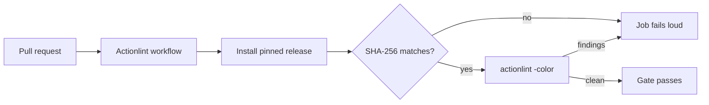

# PR Summary — Issue #119

## Summary

No workflow linted the GitHub Actions YAML itself, so a syntax error, an
invalid `${{ }}` expression or a shell bug inside a `run:` block only surfaced
when a workflow failed at runtime. This adds
`.github/workflows/actionlint.yml`, which installs a pinned
[`actionlint`](https://github.com/rhysd/actionlint) release (SHA-256 verified
before use) and runs `actionlint -color` over `.github/workflows/` on every
pull request. Closes #119.

`actionlint` reported two real SC2086 findings on the existing tree
(`ci.yml` appended to an unquoted `$GITHUB_OUTPUT`); both are quoted here so
the gate is green on merge.



## Evidence

Backend/CI change with no web interface to screenshot. Evidence is the linter
run itself, on this branch:

```
$ actionlint -color        # with the ci.yml quoting fix
$ echo $?
0

$ actionlint               # with the fix reverted
.github/workflows/ci.yml:59:9: shellcheck reported issue in this script: SC2086:info:19:23: Double quote to prevent globbing and word splitting [shellcheck]
.github/workflows/ci.yml:59:9: shellcheck reported issue in this script: SC2086:info:21:24: Double quote to prevent globbing and word splitting [shellcheck]
$ echo $?
1
```

The pinned digest was verified against the published release:
`sha256sum` of `actionlint_1.7.12_linux_amd64.tar.gz` is
`8aca8db96f1b94770f1b0d72b6dddcb1ebb8123cb3712530b08cc387b349a3d8`, matching
`ACTIONLINT_SHA256` in the workflow. 1.7.12 is the current latest release.

`./quality.sh < /dev/null` passes on this branch (Node suite plus the 95-test
Deno suite).

## Out-of-scope change, declared

`deno-quality.yml` and `markdown-lint.yml` each had a multi-line `run:` block
that did not open with `set -euo pipefail` — a pre-existing breach of the
workflow-hygiene rule that blocked the previous attempt at this issue at the
quality gate. Both are fixed here (two lines) so this change can land; no other
behaviour in those workflows was touched.

## Test Plan

- Added `tests/actionlint-workflow.test.js` (9 tests) — parses
  `actionlint.yml` via the repo's `_workflow-yaml.js` helper and asserts the
  gate's structure: PR trigger, concurrency cancellation, `contents: read`,
  an explicit `timeout-minutes`, `actions/checkout` pinned to a 40-character
  SHA, an exact release version plus 64-character SHA-256 digest, a checksum
  check that fails loud, and that `actionlint -color` is actually invoked.
  Verified red before the workflow existed (9 failed) and green after
  (9 passed).
- Existing `tests/workflow-concurrency.test.js`,
  `tests/workflow-timeout-minutes.test.js`, `tests/ci-workflow.test.js`,
  `tests/deno-quality-workflow.test.js` and
  `tests/markdown-lint-workflow.test.js` all pass unchanged.
