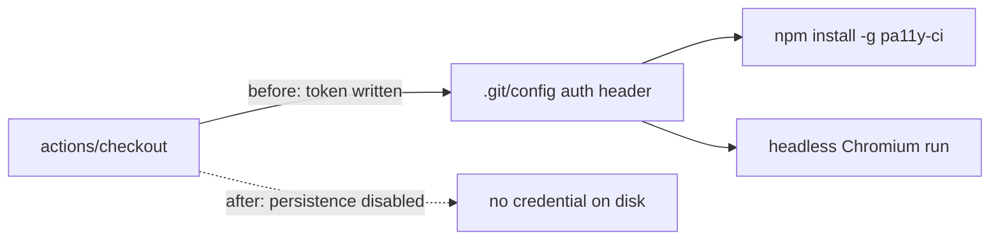

# Job `accessibility` checkout no longer persists credentials

## Summary

`.github/workflows/accessibility.yml` checked out the repository with
`actions/checkout` defaults, which write the workflow's `GITHUB_TOKEN` into
`.git/config` as an auth header. Every later step in the job — including
`npm install -g pa11y-ci` and the headless Chromium run — could read that
credential off disk and act as the token. The job only reads the checked-out
tree (serve `docs/`, run `pa11y-ci`); it never pushes back and fetches no
private submodules, so the persisted credential was pure blast radius.

The checkout step now disables credential persistence, and a regression test
asserts it stays that way. Closes #120.

## Evidence

Backend/CI-only change — no web interface to screenshot. Verified by the
Node test suite, which parses the workflow YAML into an object and asserts
on the checkout step's `with:` block:

```
$ node --test tests/accessibility-workflow.test.js
# before the fix
✖ checkout does not persist the workflow token in .git/config
  AssertionError: actions/checkout must set persist-credentials to false
  + actual - expected
  + undefined
  - false

# after the fix
✔ checkout does not persist the workflow token in .git/config
ℹ tests 9  ℹ pass 9  ℹ fail 0
```

Full gate: `./quality.sh < /dev/null` → `[quality] All checks passed.`
(257 Node assertions, 95 Deno tests). Workflow hygiene re-scanned after the
fix: no strict-mode violations remain.



## Unrequested but required change

The workflow-hygiene gate blocked this PR on two pre-existing violations in
workflows unrelated to the a11y job — `deno-quality.yml` (the folded
`deno test` block) and `markdown-lint.yml` (the Deno-detect block) — neither
of which opened with `set -euo pipefail`, so a failing command mid-block
would have been swallowed. Both now open with the strict-mode preamble; the
folded scalar became a literal block with line continuations, leaving the
`deno test` command byte-identical. Without this the PR could not be raised.

## Test Plan

- Added `tests/accessibility-workflow.test.js::checkout does not persist the
  workflow token in .git/config` — finds the `actions/checkout` step in the
  parsed workflow and asserts its `persist-credentials` input is `false`.
  Observed failing against the unfixed workflow and passing after the change.
- Re-ran the whole suite (`node --test tests/*.test.js`, 257 passing) to
  confirm no other workflow test regressed.
