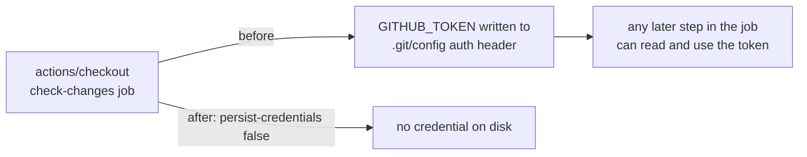

## Summary

The `check-changes` job in `.github/workflows/ci.yml` checked out the repository
with `actions/checkout` defaults, so the workflow's `GITHUB_TOKEN` was written
into `.git/config` as an auth header where any later step in the job — including
a compromised dependency or an injected script — could read it and act as the
token. The job only diffs locally to decide whether the Pages deploy fires; it
never pushes back to the repository and fetches no private submodules, so the
persisted credential was pure blast radius.

This adds `persist-credentials: false` to that checkout step, plus a regression
test that fails if the setting is dropped again. Closes #121.

## Evidence

Backend/CI-only change — there is no web interface to screenshot. Verified by
the repository's own test suite:

```
$ node --test tests/ci-workflow.test.js
✔ ci workflow check-changes checkout does not persist credentials (issue #121)
ℹ tests 12  ℹ pass 12  ℹ fail 0

$ ./quality.sh < /dev/null
[quality] Node.js test suite (tests/*.test.js) — 258 pass, 0 fail
[quality] Deno test suite (tests/*.test.ts) — 95 passed, 0 failed
[quality] All checks passed.
```

The new test was observed failing against the unfixed workflow
(`actual: undefined, expected: false`) and passing after the change.



Scope note: the sibling `quality`, `version-guard` and `deploy-pages` jobs in the
same file are tracked by their own issues (#122, #123, #124) and are deliberately
untouched here.

## Test Plan

- Added `tests/ci-workflow.test.js::ci workflow check-changes checkout does not
  persist credentials (issue #121)` — parses `ci.yml` and asserts every
  `actions/checkout` step in the `check-changes` job sets
  `persist-credentials: false`.
- Existing `tests/ci-workflow.test.js` assertions (SHA pinning, permissions,
  bash hardening) re-run unchanged.
- Full gate: `./quality.sh < /dev/null` passes.
