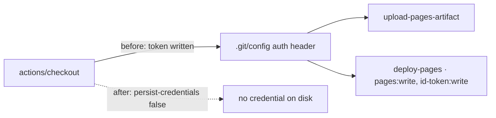

# Job `deploy-pages` checkout no longer persists credentials

## Summary

The `deploy-pages` job in `.github/workflows/ci.yml` checked out the repository
with `actions/checkout` defaults, which write the workflow's `GITHUB_TOKEN` into
`.git/config` as an auth header. Every later step in the job could read that
credential off disk and act as the token — with `pages: write` and
`id-token: write` in scope, that is the job with the largest blast radius in the
workflow. The job only reads the checked-out tree (upload `./docs` as a Pages
artefact, then activate the deployment); it never pushes back and fetches no
private submodules, so the persisted credential bought nothing.

The checkout step now sets `persist-credentials: false`, and a regression test
asserts it stays that way. Closes #122.

## Evidence

CI-only change — no web interface to screenshot. Verified by the Node test
suite, which parses `ci.yml` into an object and asserts on the `deploy-pages`
checkout step's `with:` block:

```
$ node --test tests/ci-workflow.test.js < /dev/null
# before the fix
✖ ci workflow deploy-pages checkout does not persist the workflow token (issue #122)
  AssertionError: deploy-pages actions/checkout must set persist-credentials: false
  + actual - expected
  + undefined
  - false

# after the fix
✔ ci workflow deploy-pages checkout does not persist the workflow token (issue #122)
ℹ tests 12  ℹ pass 12  ℹ fail 0
```

Full gate: `./quality.sh < /dev/null` → `[quality] All checks passed.`
(Node suite plus 95 Deno tests.)



## Scope

Sibling issues #121, #123 and #124 cover the `check-changes`, `quality` and
`version-guard` checkouts in the same file; those steps are deliberately left
untouched here.

## Test Plan

- Added `tests/ci-workflow.test.js::ci workflow deploy-pages checkout does not
  persist the workflow token (issue #122)` — locates the `actions/checkout`
  step(s) in the parsed `deploy-pages` job and asserts `persist-credentials` is
  `false`. Observed failing against the unfixed workflow and passing after the
  change.
- Re-ran the full gate (`./quality.sh < /dev/null`) to confirm no other
  workflow test regressed.
