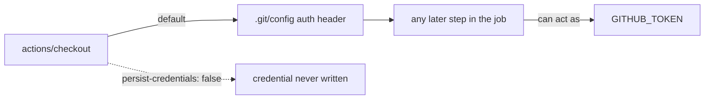

# Keep the workflow token off disk in every `ci.yml` checkout

## Summary

`actions/checkout` writes `GITHUB_TOKEN` into `.git/config` as an auth header by
default, where any later step in the job — a compromised action, an injected
script — can read it and act as the token. Only the `deploy-pages` job had
`persist-credentials: false` (Issue #122); the other three jobs in
`.github/workflows/ci.yml` still persisted it.

None of them needs it: `check-changes` and `version-guard` only diff history
that checkout already fetched, and `quality` just runs `./quality.sh` against
the checked-out tree. No job pushes back to the repository or fetches a private
submodule, so `persist-credentials: false` is now set on all four checkout
steps.

The worker's GitHub Actions file check inspects **every** `actions/checkout`
step in a workflow file the run touches, so the three jobs are fixed in one
change, as the issue's scope note requires.

Closes #123. Closes #121. Closes #124.

## Evidence

Backend/CI change only — no web interface to screenshot. Evidence is the test
suite: the new regression test in `tests/ci-workflow.test.js` was observed
failing against the unfixed workflow, naming exactly the three offending jobs:

```
✖ every ci workflow checkout does not persist the workflow token (issues #121, #123, #124)
  AssertionError: these ci.yml jobs must set persist-credentials: false on
  actions/checkout: check-changes, quality, version-guard
```

After the fix, `node --test tests/ci-workflow.test.js` reports 14/14 passing and
the full gate (`./quality.sh < /dev/null`) reports `[quality] All checks passed.`
(95 Deno assertions plus the Node suite).



## Test Plan

- Added `tests/ci-workflow.test.js::every ci workflow checkout does not persist
  the workflow token (issues #121, #123, #124)` — parses `ci.yml` and asserts
  every `actions/checkout` step, in every job, sets
  `persist-credentials: false`. It collects offenders by job id so a future
  regression names the job that broke.
- The existing `deploy-pages` assertion (Issue #122) is kept unchanged.
- Ran `node --test tests/ci-workflow.test.js < /dev/null` — 14 passed, 0 failed.
- Ran `./quality.sh < /dev/null` — all checks passed.
