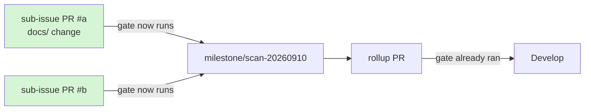

# PR Summary — Issue #143

## Summary

`.github/workflows/accessibility.yml` now runs its pa11y-ci gate on pull
requests targeting `milestone/<name>` branches, not just `Develop`.
Closes #143.

```diff
 on:
   pull_request:
+    # Issue #143: also run on PRs into milestone/<name> branches. GitHub's
+    # `*` glob stops at `/`, so a filter of ["Develop"] left every milestone
+    # sub-issue PR unchecked and a docs/PWA a11y regression stayed hidden
+    # until the rollup PR.
-    branches: ["Develop"]
+    branches: ["Develop", "milestone/*"]
     paths:
       - "docs/**"
```

**Why it matters.** Milestone sub-issue PRs merge into a shared
`milestone/<name>` branch, and only a single rollup PR reaches `Develop`.
A branch filter of `["Develop"]` therefore skipped the accessibility gate
for every sub-issue PR, so a WCAG regression in `docs/` stayed invisible
until the rollup — after other sub-issue work had already built on top of
it.

**Why a single-level glob.** GitHub branch-filter globs treat `*` as "any
run of characters except `/`", so `"Develop"` and `"*"` both exclude
`milestone/scan-20260910`. Milestone branch names carry no nested slash, so
`milestone/*` is the precise filter — `**` would needlessly widen it.

**Why `pull_request` only.** The issue scopes the fix to the PR gate: the
gate's job is to fail the sub-issue PR before the change lands on the
milestone branch. The `push` trigger and both `paths:` filters are
unchanged.

**Precedent.** `.github/workflows/ci.yml:11` already carries
`["Develop", "milestone/*"]`, and seven other workflows carry
`["*", "milestone/*"]`. `accessibility.yml` was the last `pull_request`
filter in the repository without a milestone entry.



Before this change only the rollup arrow was gated, so an a11y regression
introduced by sub-issue PR #a was first reported after PR #b had built on
top of it.

## Evidence

### The stale filter, before the change

```console
$ git show HEAD:.github/workflows/accessibility.yml | sed -n '15,21p'
on:
  pull_request:
    branches: ["Develop"]
    paths:
      - "docs/**"
      - "pa11yci.json"
      - ".github/workflows/accessibility.yml"
```

### Finding details corrected

| Claim | Issue said | Actually |
| --- | --- | --- |
| Path filter entries | `docs/**` and `pa11yci.json` | three entries — `docs/**`, `pa11yci.json` and `.github/workflows/accessibility.yml` |
| Everything else | filter at line 17 is `["Develop"]`; single-level glob suffices | confirmed — both correct |

**Red** — the new test against the unfixed workflow:

```console
$ node --test tests/accessibility-workflow.test.js < /dev/null
✖ accessibility scan runs on a milestone branch PR (0.529458ms)
  AssertionError [ERR_ASSERTION]: pull_request.branches (["Develop"]) must
  select milestone/<name> branches so milestone PRs are scanned
  false !== true
ℹ tests 11
ℹ pass 10
ℹ fail 1
```

**Green** — after the one-line filter change:

```console
$ node --test tests/accessibility-workflow.test.js \
    tests/dependency-review-workflow.test.js \
    tests/workflow-yaml-parser.test.js < /dev/null
ℹ tests 36
ℹ pass 36
ℹ fail 0
```

This is a CI-configuration change with no web interface, so no screenshots
apply — the evidence is the workflow parse assertions above plus the full
quality gate below.

## Test Plan

- `accessibility scan runs on a milestone branch PR` — parses
  `accessibility.yml` and asserts `branchMatchesFilters` selects
  `milestone/scan-20260910` for `on.pull_request.branches`.
- `accessibility scan still runs on a Develop PR` — asserts the existing
  `Develop` coverage did not regress when the milestone entry was added.

Both tests use the shared `tests/_workflow-yaml.js` helpers and assert on
the parsed workflow object (issue #42 convention), never on raw YAML text.
`branchMatchesFilters` implements GitHub's own glob semantics and is itself
covered by `tests/workflow-yaml-parser.test.js`.

**Regression linkage** — `accessibility scan runs on a milestone branch PR`
fails against the unfixed workflow (output above) and passes after the
change, so it locks the fix in place.

### Full quality gate

```console
$ ./quality.sh < /dev/null
...
ok | 95 passed | 0 failed (254ms)

[quality] All checks passed.

$ node --test tests/*.test.js < /dev/null
ℹ tests 327
ℹ pass 327
ℹ fail 0
```

Node suite 327/327 (up from 325 — the two new tests); Deno suite 95/95.

No existing test was changed, commented out, or removed.
