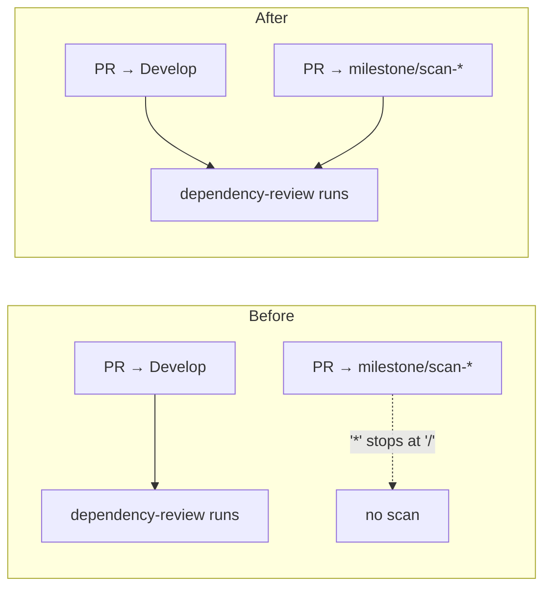

## Summary

`.github/workflows/dependency-review.yml` scoped its `pull_request` trigger to
`branches: ["*"]`. GitHub's single-level `*` glob stops at `/`, so every
`milestone/<name>` branch was silently excluded and no milestone sub-issue PR
was ever scanned by the dependency-vulnerability gate — a vulnerable dependency
could reach a milestone branch and only be caught, if at all, at the rollup PR.

The filter is now `branches: ["*", "milestone/*"]`, so flat branches keep their
existing coverage and milestone branches gain it. Closes #144.

## Evidence

Backend/CI-only change — there is no web interface to screenshot. Evidence is
the test run:

- Before the fix, `dependency-review runs on a milestone branch PR` failed with
  `pull_request.branches (["*"]) must select milestone/<name> branches so
  milestone PRs are scanned`.
- After the fix, `node --test tests/dependency-review-workflow.test.js
  tests/workflow-yaml-parser.test.js` reports `pass 24 / fail 0`.
- The full gate (`./quality.sh < /dev/null`) passes: Node suite plus the Deno
  suite (`95 passed | 0 failed`).

## Test Plan

- `tests/_workflow-yaml.js` — added `branchFilterToRegExp()` and
  `branchMatchesFilters()`, implementing GitHub's branch-glob semantics (`*`
  excludes `/`, `**` spans it, `?` is one non-slash character) so workflow tests
  assert on the branches a filter actually selects rather than its literal text.
- `tests/workflow-yaml-parser.test.js` — added unit tests for the new helpers:
  `*` matching a flat branch but not a milestone branch, `milestone/*` matching
  one level only, `**` spanning slashes, `?`, regex-metacharacter escaping,
  absent/empty/bare-string filters, and a `TypeError` on a non-string pattern.
- `tests/dependency-review-workflow.test.js` — added two regression tests: the
  workflow's `pull_request.branches` must select `milestone/scan-20260910`, and
  must still select `Develop`, `main` and `feature-144`. The first was observed
  failing against the unfixed workflow.
