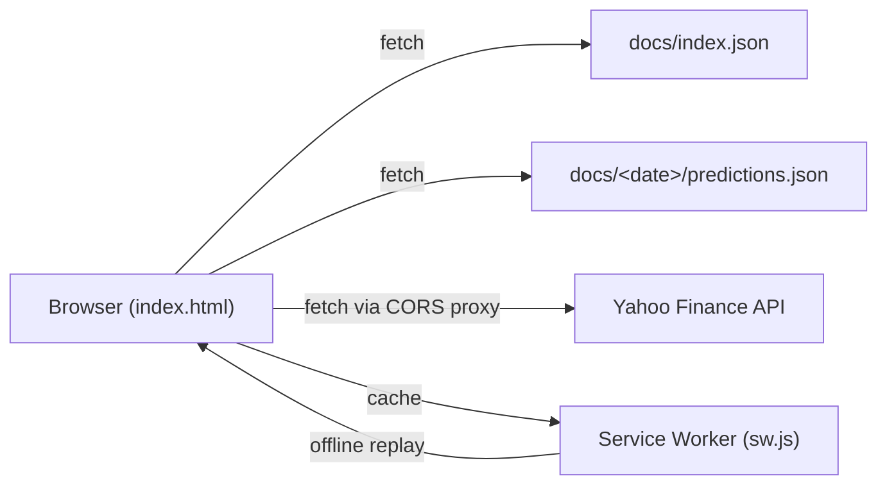

# PR Summary — issue #32

## Summary

Refreshed the repository documentation so it matches the shipped code.
The README, the two Yahoo Finance integration notes and the four
post-migration "summary" files had drifted from the live JAMstack/PWA
codebase: the README still referenced a `list.html` page that was
retired during the JAMstack consolidation, the Yahoo Finance docs still
listed `thingproxy.freeboard.io` after it was removed in issue #24, and
the historical summary documents read as if they described the current
architecture.

`README.md` now describes the live file layout (PWA service worker,
multiple front-end modules, `docs/data/`, `helpers/`, `scripts/`,
`tests/`, `quality.sh`), the security hardening (CSP meta tag, SRI pins,
Yahoo response schema validation), dark-mode, the active CORS-proxy
allowlist, and links to every standalone note in the repo. A Mermaid
flowchart captures the runtime data flow at a glance.

The four post-migration summaries (`SETUP_SUMMARY.md`,
`REFACTORING_SUMMARY.md`, `JAMSTACK_MIGRATION.md`,
`JAVASCRIPT_EXTRACTION.md`) gain a "Historical document" banner that
points readers to the README for the authoritative description of the
current code.

A new regression test (`tests/documentation-freshness.test.js`) pins the
documentation to the shipped code so the same drift cannot reappear
silently.

Closes #32.

## Evidence

This is a documentation-only change — no UI behaviour is modified.
Playwright MCP browser tools were not available in this run, so a fresh
screenshot could not be captured here; the dashboard renders exactly as
before (verified by serving `docs/` locally with `helpers/server.sh` and
confirming a 200 response from the index page).

The Mermaid diagram embedded in the updated README renders natively on
GitHub:

## Test Plan

- Added `tests/documentation-freshness.test.js` with five Node.js test
  cases, each calling `readFileSync` on the target Markdown file and
  asserting on real content:
  - README does not reference the removed `list.html` / `list.css`.
  - README mentions the current key paths (`docs/index.html`,
    `docs/index.js`, `docs/index.json`, `docs/manifest.json`,
    `docs/sw.js`, `docs/data/`, `tests/`, `quality.sh`).
  - README uses the Australian spelling "Visualise" instead of
    "Visualize".
  - The two Yahoo Finance docs no longer mention `thingproxy` and still
    name both currently-allowed proxies.
  - The four historical summary docs each carry the "Historical
    document" banner.
- `./quality.sh < /dev/null` — full quality gate passes (Node.js suite +
  Deno suite, 36 Deno tests + all Node tests including the new one).
- `markdownlint-cli2` reports 0 errors across the 25 Markdown files in
  the repository.
