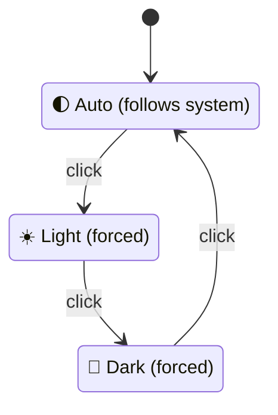

## Summary

Replaced the single-letter labels on the header theme toggle ("A", "L",
"D") with universally-recognised emojis so the active state is visually
obvious without reading. The button now shows 🌓 for Auto (first-quarter
moon, suggesting "follows system"), ☀️ for Light and 🌙 for Dark, and
cycles through the three modes on click exactly as before. Closes #34.

Two files carry the visible change:

- `docs/index.html` — the static button's initial child changed from
  `<i class="fas fa-moon">` to `<span>🌓</span>` so the default render
  (before `index.js` runs) already shows the auto emoji rather than a
  Font Awesome moon glyph, and the `title` was widened from
  "Toggle Dark Mode" to "Theme Toggle (Auto/Light/Dark)" to match the
  three-state behaviour.
- `docs/index.js` — `updateDarkMode()` and the dynamic-creation fallback
  in `initializeDarkModeToggle()` now write the three emojis to
  `toggleIcon.textContent` instead of the single letters.

`README.md` was updated in the "Toggle Theme" usage step to name the
three emojis explicitly.

## Evidence

This is a UI-content change, but Playwright MCP was not loaded in this
worker session so a live browser screenshot could not be captured. The
visible result is fully described by the source diff:

```html
<!-- docs/index.html -->
<button id="dark-mode-toggle" ...>
  <span id="dark-mode-icon" aria-hidden="true">🌓</span>
</button>
```

```javascript
// docs/index.js — updateDarkMode()
case "light":  toggleIcon.textContent = "☀️"; ...
case "dark":   toggleIcon.textContent = "🌙"; ...
case "auto":   toggleIcon.textContent = "🌓"; ...
```



The five new assertions in `tests/dark-mode-emoji.test.js` directly
verify the rendered glyphs (default icon, the three switch branches and
the absence of the legacy single-letter assignments), so a regression
that ever puts the letters back will fail the gate.

## Test Plan

- Added `tests/dark-mode-emoji.test.js` with five Node test cases:
  - default `toggleIcon.textContent` assignment is `🌓`
  - `case "light"` inside `updateDarkMode()` sets `☀️`
  - `case "dark"` inside `updateDarkMode()` sets `🌙`
  - `case "auto"` inside `updateDarkMode()` sets `🌓`
  - the legacy `"L"`/`"D"`/`"A"` `textContent` assignments are gone
  - the per-case tests extract the body of `updateDarkMode()` first so
    they cannot accidentally match the click handler's `switch
    (userPreference)` block, which also lists the three case labels but
    does not touch `textContent`.
- `./quality.sh < /dev/null` passes: 36 tests across the Node and Deno
  suites, including the five new ones.
