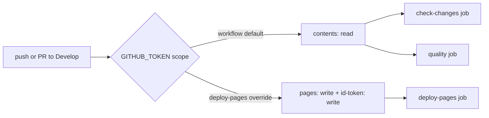

## Summary

Added a top-level `permissions: contents: read` block to
`.github/workflows/ci.yml` so the `check-changes` and `quality` jobs run
with a narrowed `GITHUB_TOKEN` scope instead of GitHub's broad default.
The pre-existing per-job `permissions:` on `deploy-pages` (which needs
`pages: write` and `id-token: write`) still overrides the workflow
default, so the Pages deploy continues to work. Closes #37.

## Evidence

This is a CI-config change with no UI surface. Verification was done by
running the project quality gate locally:

- `./quality.sh < /dev/null` — all 36 Deno tests plus the Node.js
  workflow regression tests pass, including the new regression test
  that asserts the top-level `permissions:` block is present.

## Test Plan

- Added `tests/ci-workflow.test.js::"ci workflow declares a top-level
  minimal permissions block (issue #37)"`. The test parses `ci.yml`,
  locates the column-0 `permissions:` key, and asserts the next
  non-comment line under it is `contents: read`. Verified it failed
  against the unfixed workflow (`expected a top-level permissions:
  block in ci.yml`) and passes after the workflow change.
- All pre-existing tests in `tests/ci-workflow.test.js` continue to
  pass, including the per-job `pages: write` / `id-token: write`
  assertion that guards the deploy-pages override.
