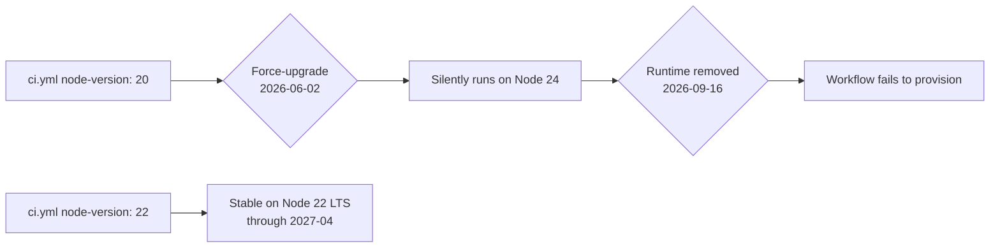

## Summary

Upgraded the `Setup Node.js` step in the `quality` job of
`.github/workflows/ci.yml` from `node-version: "20"` to `node-version: "22"`
ahead of the 2026-06-02 GitHub-hosted runner force-upgrade and the
2026-09-16 removal of the node20 runtime. The `actions/setup-node` SHA pin
is unchanged; only the requested Node major moves to the current LTS.
Closes #38.

## Evidence

This is a CI workflow change with no UI to screenshot. Verification
evidence:

- New regression test `tests/ci-workflow.test.js::ci workflow setup-node
  step uses a supported LTS Node version (issue #38)` parses every
  `setup-node` step's `node-version` and asserts it is in the
  allowlist `{ "22", "24", "lts/*" }`. The test was confirmed to fail
  against the unfixed file (saw `'20'`) and pass after the bump.
- `./quality.sh < /dev/null` passes — 36 tests across Node and Deno
  suites, 0 failures.

## Test Plan

- Added `tests/ci-workflow.test.js::ci workflow setup-node step uses a
  supported LTS Node version (issue #38)` — fails on the old
  `node-version: "20"` value, passes on `"22"`.
- Existing `tests/ci-workflow.test.js` SHA-pin and permissions tests
  continue to pass — the bump touches only the `node-version` value, not
  the `actions/setup-node` SHA.
- `./quality.sh < /dev/null` — full suite green.
