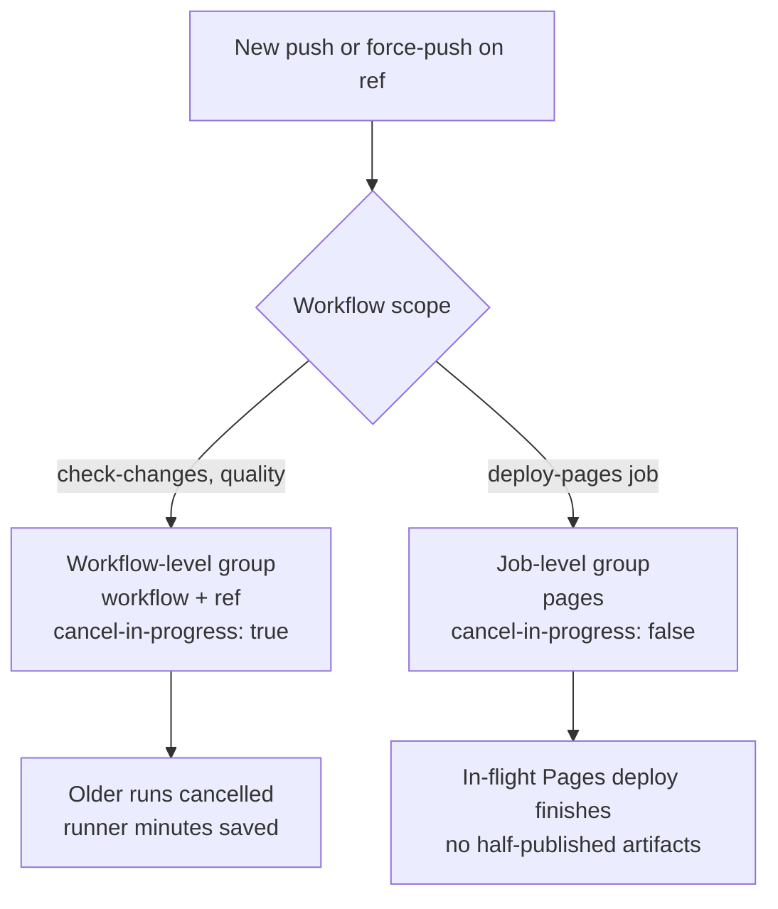

# Add concurrency groups to .github/workflows/ to cancel superseded runs

## Summary


Added a top-level `concurrency:` block to every workflow under
`.github/workflows/` so superseded runs are cancelled when a newer
commit lands on the same ref. The canonical group expression
`${{ github.workflow }}-${{ github.ref }}` with
`cancel-in-progress: true` is used for `ci.yml`, `dependency-review.yml`,
`gitleaks.yml`, `markdown-lint.yml`, `semgrep.yml`, and `shellcheck.yml`.


The `deploy-pages` job in `ci.yml` opts out of the workflow-level
cancellation with a dedicated `group: pages` /
`cancel-in-progress: false` block, mirroring GitHub's Pages-deployment
guidance so an in-flight Pages deploy is allowed to finish even when a
newer Develop commit lands. This prevents half-published artifacts on
the production site.

Closes #40.

## Evidence

This is a CI configuration change with no web UI to screenshot.
Verification is via the regression test suite — see Test Plan below.

The interaction between the workflow-level cancellation and the
deploy-pages opt-out is shown below.

## Test Plan

- Added `tests/workflow-concurrency.test.js` with 19 tests covering:
  - Every required workflow (`ci.yml`, `dependency-review.yml`,
    `gitleaks.yml`, `markdown-lint.yml`, `semgrep.yml`, `shellcheck.yml`)
    declares a top-level `concurrency:` block.
  - The group expression is the canonical
    `${{ github.workflow }}-${{ github.ref }}` form.
  - `cancel-in-progress: true` at workflow scope.
  - The `deploy-pages` job in `ci.yml` uses a dedicated `pages` group
    with `cancel-in-progress: false`.
- Ran `./quality.sh < /dev/null` — all 36 tests pass (Node + Deno suites).
