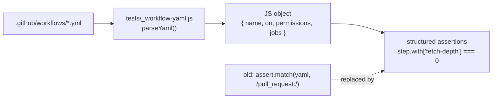

## Summary

The `tests/*-workflow.test.js` suite previously asserted on the raw
text of `.github/workflows/*.yml` with `assert.match` and regular
expressions. That is a textbook HOW-test: it passes when the YAML
contains the right *words* and fails when a maintainer reformats the
file, even though the underlying CI gate is unchanged. The pin-SHA
regexes were the worst of these — they only verified a 40-character
hex string was present, not that it was a valid commit on the action's
repo.

This PR replaces the regex-on-text assertions with structural
assertions against a parsed JavaScript object. A new
`tests/_workflow-yaml.js` helper parses the workflow YAML (mappings,
sequences, literal blocks, flow scalars, comments) and the six
workflow regression files now load the structured object and assert on
fields like `wf.jobs.gitleaks.steps[0].uses`,
`wf.permissions.contents`, or `step.env.SEMGREP_APP_TOKEN` instead of
regex-matching the surrounding text.

The new tests preserve every behaviour the old tests asserted (pinned
40-character SHAs, least-privilege permissions, `fetch-depth: 0`,
`set -euo pipefail` hardening, container sha256 digest, secret env
wiring, etc.) but tolerate benign reformatting of the YAML — reordered
keys, extra blank lines, quoted vs unquoted scalars. A reformat that
preserves the contract no longer breaks the suite; a contract change
still fails loudly.

Closes #42.

## Evidence

This is a backend/test refactor with no web UI to screenshot. Evidence:

- 45 rewritten workflow tests pass against the existing
  `.github/workflows/` files (see `tests/{ci,gitleaks,semgrep,shellcheck,markdown-lint,dependency-review}-workflow.test.js`).
- 8 new parser tests in `tests/workflow-yaml-parser.test.js` pin the
  parser contract — including a "reformatting preserves structure"
  test that re-parses the same workflow with reordered keys and
  asserts the resulting object is equivalent.
- `./quality.sh` passes the full suite (124 Node tests + Deno tests,
  all 0 failures).

## Test Plan

- [x] Rewrote `tests/gitleaks-workflow.test.js` — `name`, `on`,
      `permissions`, `fetch-depth`, action SHAs, fetch-base-branch
      step, and secret env wiring now assert on parsed fields.
- [x] Rewrote `tests/markdown-lint-workflow.test.js` — `name`, `on`,
      pinned third-party actions, `markdownlint-cli2` invocation, and
      permissions assert on parsed fields.
- [x] Rewrote `tests/ci-workflow.test.js` — top-level permissions,
      job-level deploy-pages permissions, every `actions/*` ref pinned
      to a SHA, supported LTS Node version, and the `set -euo pipefail`
      hardening of the `Check for changes` step all assert on parsed
      fields.
- [x] Rewrote `tests/semgrep-workflow.test.js` — container image
      `@sha256:` pin, `semgrep ci --config p/default` invocation, and
      `SEMGREP_APP_TOKEN` env wiring assert on parsed fields.
- [x] Rewrote `tests/shellcheck-workflow.test.js` — `ludeeus/action-shellcheck`
      pinned ref, `with.scandir` / `with.severity`, and permissions
      assert on parsed fields.
- [x] Rewrote `tests/dependency-review-workflow.test.js` — pinned refs
      and floating-tag rejection assert on parsed fields.
- [x] Added `tests/workflow-yaml-parser.test.js` (8 tests) covering
      mappings, sequences, literal `run: |` blocks, comments,
      booleans/integers, reformatting robustness, and the
      `collectActionRefs` helper.
- [x] `tests/renovate-quarantine.test.js` — already parses JSON
      structurally, left unchanged.
- [x] `./quality.sh < /dev/null` passes (124 Node + 36 Deno tests, 0
      failures).
