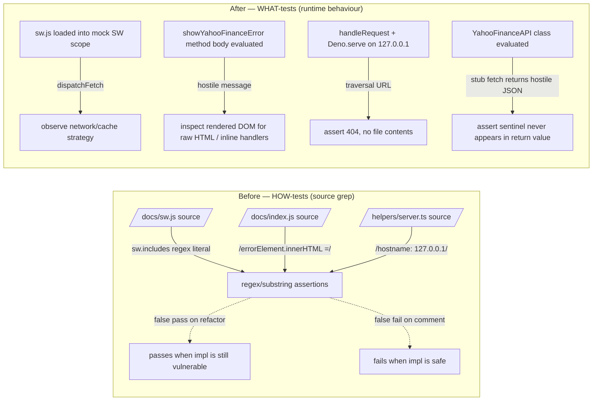

## Summary

Replaces six security tests that grep the source of `docs/*.js` /
`helpers/server.ts` with behavioural tests that actually exercise the
vulnerable code paths and assert on observable side effects. The
previous tests verified the *current implementation's source text* —
they would have passed when a maintainer replaced `innerHTML =` with
`insertAdjacentHTML(…)` (still XSS-vulnerable) and failed when a
maintainer kept the safe implementation but added an unrelated comment
containing the searched-for substring. Closes #43.

## Evidence



### Tests rewritten as runtime behaviour checks

| File / lines (before) | Old assertion | New assertion |
| --- | --- | --- |
| `tests/sw-pathname-guards.test.ts` (whole file) | `sw.includes("/\\/data\\/.*\\.csv$/")` etc. | Load sw.js into a mock SW scope, dispatch fetch events for `/data/*.csv`, `/<date>/predictions.json`, `/index.json`, `/index.js`, `/manifest.json`, cross-origin, POST; assert the observable strategy (network-only, network-first, cache-first, ignored). |
| `tests/yahoo-error-banner-xss.test.ts:211-234` | Slice 800 chars around `showYahooFinanceError`, regex for `errorElement.innerHTML =`. | Extract the method body, evaluate against a mock DOM with a malicious `` message, assert the rendered DOM contains no raw `= 4`. | Extract the `YahooFinanceAPI` class body, evaluate it with `fetch` stubbed to return a payload carrying a `POWNED-XSS-MARKER-2026` sentinel that the real validator rejects. Call `getFXPairDescription`, `validateFXPair`, `fetchFXData`, `fetchOptimizedFXData` and assert the sentinel does not appear in any return value (deep search). |

### Tests deleted with documented runtime replacement

| File / lines | Why deleted | Runtime coverage instead |
| --- | --- | --- |
| `tests/pwa-index-freshness.test.js:47-61, 87-123` | Source-grep guards for SW pathname regexes. | The `tests/sw-pathname-guards.test.ts` behavioural suite (added above) dispatches real fetch events. A new stub test asserts that file exists and dispatches fetch events, so a careless `git rm` cannot silently drop runtime coverage. |
| `tests/csp-meta.test.js:197-210` | Source-grep guard for inline event handlers in `docs/index.js`. | The CSP meta tag itself (asserted above in the same file) forbids `unsafe-inline` on `script-src`, so the browser refuses to execute any inline event handler at runtime. `tests/fx-card-xss.test.ts::buildFXPairCard does not emit an inline onclick attribute` and `tests/yahoo-error-banner-xss.test.ts::showYahooFinanceError renders attacker-controlled messages as encoded text (DOM-level)` exercise the rendering paths and scan tag headers for `on*=`. |

### Test left in place with a clarifying note

`tests/cdn-sri-pins.test.js` was listed in the issue but is left
intact: SRI is enforced by the browser based on the `integrity`
attribute in the static HTML, so asserting on the deployed HTML's
shape *is* asserting on the security control — analogous to asserting
that the CSP meta tag declares the right directives. A clarifying
comment was added at the top of the file documenting this distinction.

## Test Plan

- Added: `tests/sw-pathname-guards.test.ts` — 9 runtime SW behaviour
  tests covering CSV/JSON dynamic paths, network-first, cache-first,
  cross-origin pass-through, and method filtering.
- Added: `tests/yahoo-error-banner-xss.test.ts::showYahooFinanceError
  renders attacker-controlled messages as encoded text (DOM-level)` —
  DOM-level XSS test exercising the actual method.
- Added: `tests/server-path-traversal.test.ts::handleRequest returns
  404 for path-traversal requests with no file contents` and `Dev
  server bound to 127.0.0.1 refuses path traversal over the wire` —
  in-process + live-wire integration tests.
- Added: `tests/yahoo-response-validation.test.ts::Every
  YahooFinanceAPI fetch path rejects payloads the validator marks
  invalid` — exercises all four proxy fetch paths with a hostile
  payload and asserts the sentinel never reaches the return.
- Replaced: 4 source-grep tests across `tests/pwa-index-freshness.test.js`
  and `tests/csp-meta.test.js` with stub tests / documentation that
  point at the runtime equivalents.

Total suite: 44 tests passing (up from 36).

Run locally:

```bash
./quality.sh < /dev/null
```
