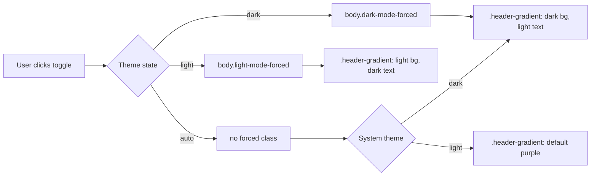

## Summary

Made the top `.card-header.header-gradient` banner react to the theme toggle
instead of staying purple in every state. Added explicit overrides for
`body.light-mode-forced`, `body.dark-mode-forced`, and
`@media (prefers-color-scheme: dark) body:not(.dark-mode-forced)`, dropped
the `!important` lock on the default rule's `color`, and bumped the
`styles.css` cache-busting query so deployed PWAs pick up the change.

Closes #44.

## Evidence

Playwright screenshots of the header in each theme state (`docs/evidence/`):

| State | Screenshot |
| --- | --- |
| Light forced |  |
| Dark forced |  |
| Auto + system light (brand purple preserved) |  |
| Auto + system dark |  |

## Test Plan

- Added `tests/header-theme.test.js` (mirrors `tests/dark-mode-emoji.test.js`)
  with eight assertions: each of the three theme states ships a
  `.header-gradient` override block and an `h1, p` colour override, the
  default rule still uses the brand `--primary-color` / `--secondary-color`
  gradient, and `docs/index.html` bumps the `styles.css?v=` query past
  `1.0.103`.
- `./quality.sh < /dev/null` — all 36 tests pass (Node + Deno).
- Playwright screenshots captured for each of the four header states and
  visually verified.

## Acceptance Criteria

- [x] Toggling the theme button cycles the header's background and text
      colours in step with the rest of the page.
- [x] `.header-gradient` CSS has explicit rules for
      `body.light-mode-forced`, `body.dark-mode-forced`, and
      `@media (prefers-color-scheme: dark) body:not(.dark-mode-forced)`.
- [x] Header text remains readable (dark text on `#f8f9fa→#e9ecef` light
      ramp; `#f0f6fc` text on `#0d1117→#161b22` dark ramp — both well
      above WCAG AA contrast).
- [x] `tests/header-theme.test.js` is picked up by `./quality.sh`'s
      `tests/*.test.js` glob and passes.
- [x] Playwright screenshots saved under `docs/evidence/` and referenced
      above.
- [x] Australian English throughout (colour, behaviour).
