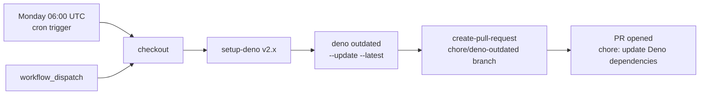

## Summary

Adds the missing **Deno Dependency Updates** GitHub Actions workflow
(`.github/workflows/deno-outdated.yml`) so Deno deps in `deno.json` /
`deno.lock` are refreshed automatically every Monday at 06:00 UTC. The
workflow runs `deno outdated --update --latest` and opens a chore PR via
`peter-evans/create-pull-request`. Closes #61.

The workflow follows the same security posture as the rest of the
repository:

- Every third-party action is pinned to a 40-character commit SHA
  (Issue #14), not a floating tag.
- `denoland/setup-deno` is pinned to `v2.x`.
- `peter-evans/create-pull-request` uses the org-level PAT
  (`secrets.ACTIONS_PUSH`, Issue #1636) with a `secrets.GITHUB_TOKEN`
  fallback so downstream PR workflows fire on the resulting PR.
- Permissions are scoped to `contents: write` + `pull-requests: write`
  (the minimum the action needs to push a branch and open a PR).
- A concurrency group cancels superseded runs so a manual
  `workflow_dispatch` cannot race the scheduled run into opening two PRs.
- The job has a 15-minute timeout — well under the 360-minute GitHub
  default that would otherwise bill a wedged runner.

## Evidence

Backend / CI-only change with no UI surface to screenshot. Verification
comes from the new regression test file:

- `tests/deno-outdated-workflow.test.js` parses the workflow YAML and
  asserts on the structured contract (triggers, cron expression, pinned
  SHAs, `deno outdated --update --latest` invocation, token fallback,
  permissions, runner and timeout).
- `./quality.sh` passes with the new tests added.

### Deno regression avoided

Repository is a Deno repo (`deno.json` + `deno.lock` present). The
workflow uses Deno-native tooling (`deno outdated`) rather than
introducing `npm`, `pnpm` or `npm-check-updates`.

## Test Plan

- Added `tests/deno-outdated-workflow.test.js` covering:
  - Workflow file exists at `.github/workflows/deno-outdated.yml`.
  - Workflow is named `Deno Dependency Updates` and runs on
    `schedule` + `workflow_dispatch` with the cron `0 6 * * 1`.
  - Every third-party action (`actions/checkout`, `denoland/setup-deno`,
    `peter-evans/create-pull-request`) is pinned to a 40-character
    commit SHA.
  - `denoland/setup-deno` is pinned to `v2.x`.
  - A `deno outdated --update --latest` step is present.
  - The `create-pull-request` step uses
    `secrets.ACTIONS_PUSH || secrets.GITHUB_TOKEN` for `token`, sets the
    `chore/deno-outdated` branch, and supplies a commit message and
    title.
  - `contents: write` and `pull-requests: write` are granted (at either
    workflow or job scope).
  - Runs on `ubuntu-latest` with a small positive `timeout-minutes`.
- `./quality.sh` (Node `--test` + Deno `test --frozen`) passes locally
  with the new tests included.
