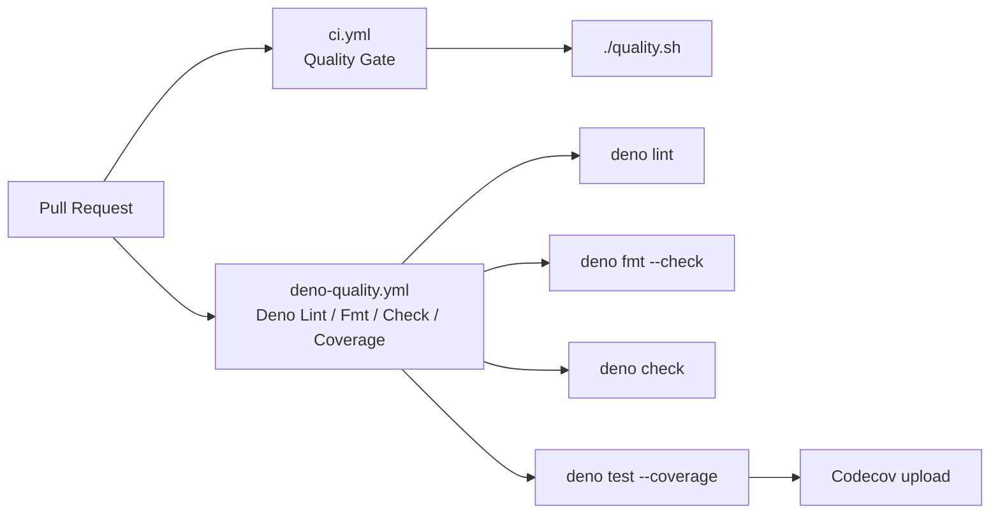

# PR Summary — Issue #62

## Summary

Added a dedicated `Deno Quality` GitHub Actions workflow that runs
`deno lint`, `deno fmt --check`, `deno check` and `deno test --coverage`
on every pull request, mirroring the template proposed by the
workflow-sync bot. Scoped `deno.json` so the lint/fmt gates apply to
the Deno source (`helpers/`, `tests/*.ts`) and exclude the browser
JavaScript under `docs/`, `tests/*.js` and `scripts/`. Closes #62.

This adds a Deno-native CI gate alongside the existing CI/CD pipeline.
The existing `quality.sh` continues to run the Node + Deno test
suites; the new workflow adds the lint, format and type-check
gates that the repository was previously missing.

## Evidence

This change is CI-only — no UI to screenshot. Verified locally:

- `deno lint` — clean (6 files checked, 0 problems).
- `deno fmt --check` — clean (6 files checked).
- `deno check helpers/server.ts tests/*.test.ts` — type-checks pass.
- `./quality.sh < /dev/null` — Node suite (151 tests) and Deno suite
  (44 tests) both pass.
- `node --test tests/deno-quality-workflow.test.js` — 10/10 pass.

### Deno regression avoided

This repository already uses Deno (`deno.json`, `deno.lock`) for its
TypeScript helpers and tests. The new workflow stays Deno-native — it
does not introduce Node-only tooling and does not regress the existing
`quality.sh` pathway, which already runs `deno test --frozen`.

## Test Plan

Added:

- `tests/deno-quality-workflow.test.js` — parses the new workflow YAML
  into a JavaScript object (via `_workflow-yaml.js`) and asserts on its
  structured fields:
  - workflow file exists with the expected name and PR trigger;
  - every third-party action is pinned to a 40-character commit SHA
    (`actions/checkout`, `denoland/setup-deno`, `codecov/codecov-action`);
  - `denoland/setup-deno` is pinned to `deno-version: v2.x`;
  - the job runs `deno lint`, `deno fmt --check` and `deno check`;
  - the job runs `deno test --coverage=…` followed by
    `deno coverage … --lcov` and uploads `coverage.lcov` to Codecov
    with `fail_ci_if_error: false`;
  - the job uses least-privilege `contents: read`;
  - the job runs on `ubuntu-latest` with a bounded `timeout-minutes`;
  - a concurrency block cancels superseded runs;
  - `deno.json` declares `lint.include` and `fmt.include` covering
    `helpers/` and `tests/`.

Modified (auto-format only — no behavioural changes):

- `tests/sw-pathname-guards.test.ts`
- `tests/yahoo-error-banner-xss.test.ts` (also removed a stray
  `deno-lint-ignore no-explicit-any` that the new lint gate flagged as
  unused)
- `tests/yahoo-response-validation.test.ts`

All existing tests continue to pass.
