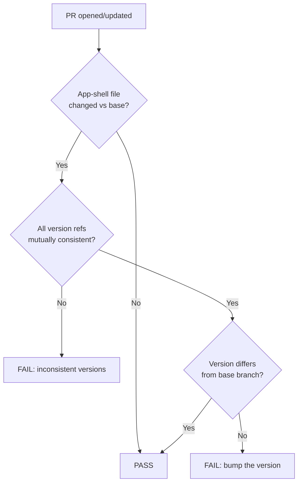

# Fail PR when docs change without a PWA version bump; fix stale version

## Summary

The PWA served from `docs/` busts browser and service-worker caches with a
single `VERSION`, mirrored into the `?v=` query strings and version span in
`index.html`, the `sw.js?v=` string in `sw-register.js`, and the `grq-fx-*`
cache names in `sw.js`. A local `scripts/pre-commit` hook auto-increments it,
but only for contributors who installed it — so an app-shell change could be
merged without a bump, leaving the deployed PWA serving stale cached assets.
The live version had in fact already drifted (`styles.css?v=1.0.105` against
`VERSION = "1.0.103"`).

This change adds a **fail-only** CI guard and fixes the stale version, built
test-driven:

- **`helpers/version_check.ts`** — pure, I/O-free guard logic: extract every
  version reference, check they are mutually consistent, and evaluate whether
  an app-shell change versus the PR base branch was accompanied by a bump.
- **`scripts/check-version-bump.ts`** — fail-only CI wrapper doing the git
  I/O (diff against the base, read the base `VERSION`); prints a clear
  remediation message and exits non-zero. Never auto-bumps or commits.
- **`.github/workflows/ci.yml`** — new `version-guard` job, runs on PRs only,
  full-history checkout so the base ref is diffable.
- **One-off bump to `1.0.106`** across all references — fixes the stale and
  drifted version. A regression test over the live `docs/` files enforces it.
- **`scripts/pre-commit`** — generalised so future auto-bumps stay consistent
  with the new guard: it now updates *every* `?v=` query string, all three
  `sw.js` cache names (default/static/dynamic) and `sw-register.js`, not just
  a hand-picked subset.

The guard treats a file as **app shell** when it is a root-level `docs/`
cache-busted asset (`index.html`, `index.js`, `sw.js`, `sw-register.js`,
`styles.css`, `safe-card.js`, `safe-error-banner.js`, `yahoo-validate.js`).
Dated daily-data directories and data/config files are excluded.

Closes #65.

## Evidence

This is a backend/CI change with no web-interface change, so no screenshot
applies. Verified via the new tests plus end-to-end runs of the guard CLI:

PASS path (app-shell changed **and** version bumped):

```
[version-guard] PASS: App-shell changed and version bumped from 1.0.103 to 1.0.106.
EXIT: 0
```

FAIL path (app-shell changed **without** a bump):

```
[version-guard] FAIL

App-shell files changed but the PWA version is still 1.0.103.
Changed app-shell files:
  - docs/index.html
  - docs/styles.css

Bump the VERSION constant in docs/index.js and mirror it into ...
EXIT: 1
```

Guard decision flow:



## Test Plan

- **`tests/version-bump-guard.test.ts`** (Deno) — unit tests for the real
  functions in `helpers/version_check.ts`:
  - `isValidSemver`, `isAppShellFile`/`appShellChanges` (incl. excluding
    dated data dirs, `index.json`, `manifest.json`, `*.md`).
  - `extractVersionRefs` for the VERSION constant, every query string, the
    version span, all three `sw.js` cache names and the `sw-register.js`
    string.
  - `checkConsistency` happy path, single-reference drift (reproduces the
    live `styles.css` bug), no-references and malformed-version cases.
  - `evaluateBump` for no-change, not-bumped (fail), bumped (pass),
    inconsistent-tree (fail) and missing-base cases.
  - A regression test loading the **live** `docs/` shell files and asserting
    they are mutually consistent — red before the `1.0.106` bump, green
    after.
- **`tests/version-guard-workflow.test.js`** (Node) — parses `ci.yml` and
  asserts the `version-guard` job exists, runs only on `pull_request`, checks
  out full history, and invokes `check-version-bump.ts` with the base SHA.

All checks pass via `./quality.sh` (Node + Deno suites), `deno fmt --check`,
`deno lint`, and `deno check scripts/check-version-bump.ts`.
