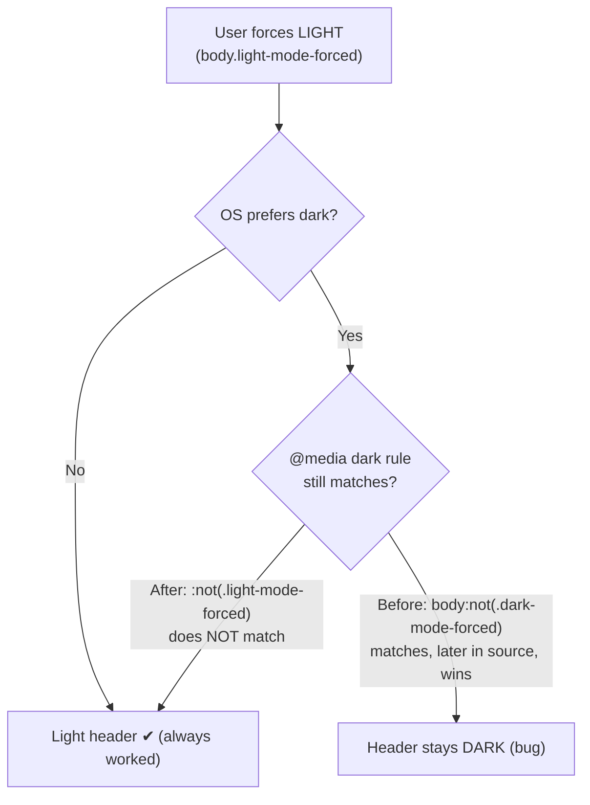

# Heading section now follows the selected theme (issue #67)

## Summary

The top heading section (the `.header-gradient` banner and its
`#dark-mode-toggle` button) did not follow the **selected** theme: when the
operating system was in dark mode but the user forced **light** mode in the
app, the page body went light while the header stayed dark (see the issue
screenshot). Closes #67.

**Root cause — a specificity tie resolved by source order.** Issue #44 added
theme-aware header overrides, but the auto+system-dark block used the selector
`body:not(.dark-mode-forced)`. A light-forced body (`body.light-mode-forced`)
is still "not dark-forced", so that selector *also* matched in forced-light
mode. It tied on specificity **and** `!important` with the
`body.light-mode-forced` rule, and — appearing later in the file — won the
cascade whenever the OS preferred dark, pinning the heading to dark colours.

**Fix.** Add a `:not(.light-mode-forced)` guard to the three auto+system-dark
selectors in `docs/styles.css` so they only apply in genuine *auto* mode (no
forced theme):

- `.header-gradient` background/colour
- `.header-gradient h1, .header-gradient p` text colour
- `#dark-mode-toggle` (and `:hover`) styling

This makes the forced-light rules win unconditionally while leaving auto mode,
forced-dark mode, and the default purple identity untouched.

The PWA app-shell version was bumped `1.0.106 → 1.0.107` consistently across
`index.html`, `index.js`, `sw.js`, and `sw-register.js` to satisfy the
version-guard (issue #65) and bust caches.

## Evidence

Light selected while the OS is in dark mode — header is now light and matches
the page (previously it stayed dark, as in the issue screenshot):

Dark selected while the OS is in light mode — header is dark and matches the
page:

Screenshots captured headlessly via the Chrome DevTools Protocol with
`Emulation.setEmulatedMedia` forcing `prefers-color-scheme` and the theme
preference seeded into `localStorage`. Computed `background-color` confirmed:
`#f8f9fa` (light) for light-selected+OS-dark, dark `rgb(33,38,45)` for
dark-selected.

## Test Plan

- **Added `tests/heading-theme-cascade.test.js`** — a real CSS cascade
  resolver (parses `docs/styles.css`, computes specificity, `!important` and
  source order) that determines the *winning* declaration for the heading
  elements in each scenario. Asserts behaviour, not source patterns, so it
  survives any fix strategy:
  - header background/text follow LIGHT selection even when the OS is dark
    (these reproduced the bug — red before the fix, green after)
  - toggle button follows LIGHT selection when the OS is dark
  - DARK selection, AUTO+system-dark, AUTO+system-light (purple identity),
    and LIGHT+system-light all keep working
- **Updated `tests/header-theme.test.js` and `tests/theme-toggle-styling.test.js`**
  — the existing selector-shape regexes hard-coded the old
  `body:not(.dark-mode-forced)` selector; they now also accept the new
  optional `:not(.light-mode-forced)` qualifier. Documented inline as required
  by the fix.
- `./quality.sh` passes cleanly: **65 passed, 0 failed**, including the
  version-consistency guard.
