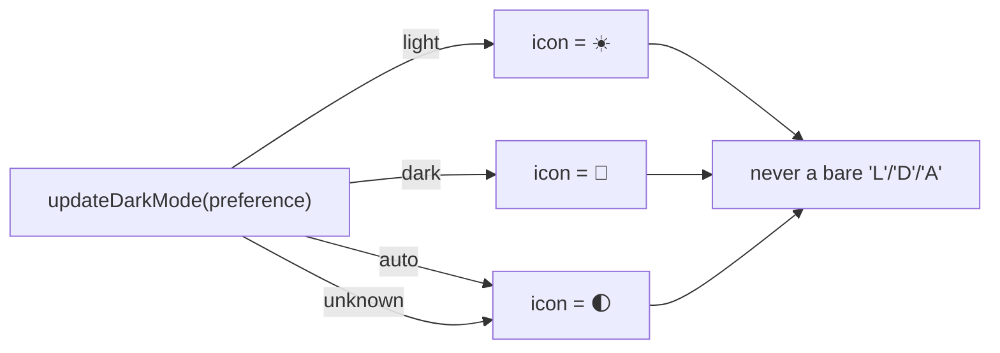

# Rewrite dark-mode-emoji tests as WHAT-tests

## Summary

`tests/dark-mode-emoji.test.js` asserted on the *source text* of
`docs/index.js` — it read the file as a string and regex-matched the
`switch`/`case` shape and the exact `toggleIcon.textContent = "<emoji>"`
spelling of the internal `updateDarkMode()` function. Those HOW-tests
broke on any behaviour-preserving refactor (switch → lookup map,
computed glyph, extracted constant) while a genuine wrong-glyph change
using the "approved" mechanism still passed.

This PR rewrites all five assertions as **WHAT-tests** that exercise the
real code. Following the repo's existing pattern
(`tests/fx-card-xss.test.ts`), the test now extracts the production
`updateDarkMode()` out of `docs/index.js` and **executes** it against a
minimal DOM mock, asserting the toggle icon's rendered `textContent` for
each theme state — the glyph a user actually observes. No production
code changed; only the test file was rewritten.

Closes #69.

## Behaviour verified

The tests assert the **rendered outcome**, so they:

- **fail on a real regression** — verified by temporarily setting the
  light branch to `"L"`: both the glyph test and the single-letter guard
  failed (`light state should render ☀️, got "L"`).
- **survive a behaviour-preserving refactor** — verified by replacing
  the `switch` with a lookup-map implementation: all 5 tests still pass.

The old absence-grep (lines 111–122) only caught one literal spelling of
a single-letter assignment. Its replacement checks the rendered glyph for
every state, so a bare `'L'`/`'D'`/`'A'` produced by *any* code path is
caught.

## Test Plan

`tests/dark-mode-emoji.test.js` (rewritten, runs under `node --test`):

- `light state renders the sun emoji` → `textContent === "☀️"`
- `dark state renders the crescent-moon emoji` → `textContent === "🌙"`
- `auto state renders the first-quarter-moon emoji` → `textContent === "🌓"`
- `unknown preference falls back to the auto emoji` → `textContent === "🌓"`
  (replaces the old default-icon source grep with the observable fallback)
- `no state renders a bare single-letter label` → drives every state and
  asserts the glyph is never `L`/`D`/`A`

All checks pass via `./quality.sh` (65 passed, 0 failed). `docs/index.js`
is byte-for-byte unchanged.

### Deno regression avoided

Kept the test as a Node `.test.js` driving a hand-rolled DOM mock instead
of pulling in `jsdom` (a Node-only dependency that would add
`node_modules`/`package.json` to this Deno repo) — mirrors the existing
`tests/fx-card-xss.test.ts` harness.
