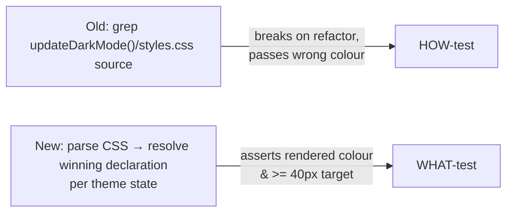

# PR Summary — Issue #70

## Summary

`tests/theme-toggle-styling.test.js` guarded the dark-mode toggle by
grepping **source text** (anti-pattern #2): which property
`updateDarkMode()` assigns (`assert.doesNotMatch(body, /…style.backgroundColor/)`
plus `assert.match(body, /classList/)`), the exact CSS selector spelling for
each theme override, and the `min-width`/`min-height: 40px` literals.
Those HOW-tests dictated the *mechanism*, not the *outcome*: a
behaviour-preserving refactor (set the colour another way, express the
same touch target via `width`/`rem`, restructure the cascade) broke them
with no rendered regression, while a wrong-colour change using the
"approved" `classList` mechanism passed.

This PR rewrites those blocks as **WHAT-tests**. Using the small, real
CSS cascade resolver (first written for Issue #67's
`heading-theme-cascade.test.js`, now factored into a shared
`tests/_css_cascade.js`), the tests compute the declaration that actually
**wins** the cascade for `#dark-mode-toggle` in each theme state and
assert the rendered colour and a unit-normalised `>= 40px` touch target
— never the function's or stylesheet's source text.

The toggle's colour is driven by the **body** theme class plus the OS
colour-scheme; `updateDarkMode()` sets that body class, so the
computed-outcome assertions describe exactly "the toggle ends up the
right colour for the active theme" independent of how the implementation
gets there.

Closes #70.

## Evidence

This is a test-only (CLI) change — no rendered UI changed, so there is no
screenshot. Evidence is the test behaviour itself.

**Mutation testing** (temporary edits to `docs/styles.css`, reverted)
proves the new assertions track behaviour, not text:

| Change to `styles.css` | Expected | Result |
| --- | --- | --- |
| dark-forced toggle background → a light colour | fail | ✖ `renders the DARK-forced colours`, ✖ `…different backgrounds` |
| `min-width`/`min-height` 40px → 32px | fail | ✖ `keeps a >= 40px touch target` |
| `min-width/height: 40px` → `width/height: 2.5rem` (same 40px) | pass | ✔ all 9 pass |

So a behaviour-breaking change fails and a behaviour-preserving refactor
survives — the opposite of the old source greps.

Full quality gate: `./quality.sh` → **65 passed | 0 failed**, `[quality] All checks passed.`

## Test Plan

- **`tests/_css_cascade.js`** (new): shared cascade resolver
  (`parseRules`, `resolve`, `bodyWith`) lifted verbatim from the proven
  Issue #67 implementation — no logic change.
- **`tests/theme-toggle-styling.test.js`** (rewritten flagged blocks):
  - `toggle renders the LIGHT-forced colours` — background `rgba(255,255,255,…)`, text `#212529`, for both OS schemes (Issue #67 invariant).
  - `toggle renders the DARK-forced colours` — background `rgba(0,0,0,…)`, text `#f0f6fc`, both OS schemes.
  - `toggle renders the AUTO + system-DARK colours` — dark background/light text.
  - `toggle renders the AUTO + system-LIGHT default colours` — translucent white background, white text.
  - `toggle light-forced and dark-forced render different backgrounds` — states must not collapse.
  - `toggle keeps a >= 40px touch target in every theme state` — unit-normalised (`px`/`rem`) effective minimum across `min-*`/explicit dimensions.
  - `toggle stays centred via flex so the icon sits in the touch target`.
  - Kept (out of Issue #70 scope): the no-inline-`style=` guard and the cache-busting version check.
- **`tests/heading-theme-cascade.test.js`**: refactored to import the
  shared resolver (DRY); assertions unchanged, still passing.
