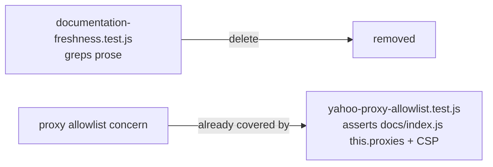

## Summary

Removed `tests/documentation-freshness.test.js`, which used `readDoc(...)` to grep
README and other Markdown prose and assert on substrings. This is anti-pattern #2
(source-text greps used as assertions): the target is documentation prose that no
runtime code path consumes, so it is not an observable program behaviour. Any
legitimate rewording, restructuring of the README's file-layout section, or rename
would break these tests even though nothing about the program regressed.

The one check that mapped to actual behaviour — the Yahoo Finance proxy allowlist
(former lines 60-75) — is already covered by `tests/yahoo-proxy-allowlist.test.js`,
which asserts on the running code's resolved proxy list (the `this.proxies` array in
`docs/index.js`) and the CSP `connect-src` directive. That behavioural coverage is
unchanged. The deleted doc-prose checks only asserted what a `.md` file *said* about
the allowlist, which can drift from the actual code in either direction and gave
false assurance about behaviour it never exercised.

The remaining checks (removed `list.html`/`list.css` mentions, current file-layout
strings, `Visualize` spelling, `Historical document` banners) have no observable
behaviour to assert, so per the issue's suggested fix (b) they are deleted.
Doc-drift and spelling belong in a Markdown/prose linter in CI, not the unit-test
suite.

Closes #71.

## Evidence

Backend/test-suite change only — no web interface to screenshot.

- `./quality.sh < /dev/null` passes cleanly after the deletion: `65 passed | 0 failed`.
- Behavioural proxy-allowlist coverage retained in `tests/yahoo-proxy-allowlist.test.js`.

## Test Plan

- Deleted `tests/documentation-freshness.test.js` (5 prose-grep tests, no behaviour).
- Verified `tests/yahoo-proxy-allowlist.test.js` still exercises the active proxy
  allowlist from `docs/index.js` and the CSP — the only behavioural concern in the
  removed file.
- Ran `./quality.sh < /dev/null`: full Node + Deno suite passes (`65 passed | 0 failed`).
