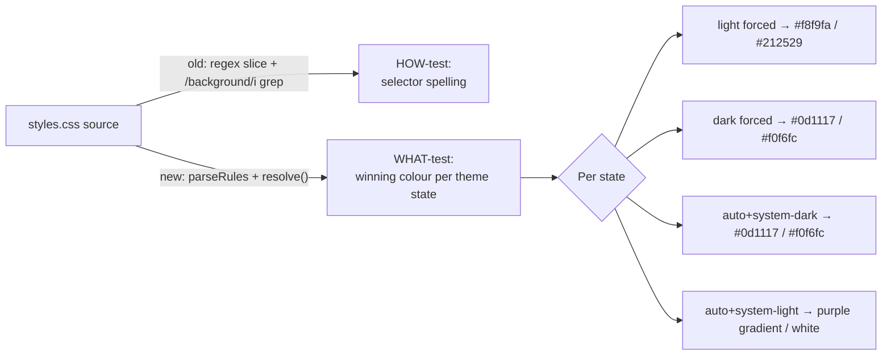

## Summary

Rewrote `tests/header-theme.test.js` from source-text greps into rendered-outcome
(WHAT) tests. Closes #72.

The seven CSS assertions previously read `docs/styles.css` as a raw string, sliced
out a selector's declaration block with `extractBlock(src, /…/)`, and asserted only
that the block *existed* and contained the word `background` or a `color:`
declaration. This is anti-pattern #2 (source-text greps used as assertions): a
behaviour-preserving refactor (consolidating selectors, switching to a shared theme
class, moving to CSS custom properties) would change the source text and break every
assertion while the header rendered identically, and a rule that merely contained the
word `background` but resolved to the wrong colour would still pass. The tests
asserted *how* the stylesheet was spelled, not *what* colour the user sees.

They now use the shared CSS cascade resolver (`tests/_css_cascade.js`, first written
for issue #67 and factored out in #70). For each of the three theme states the tests
compute the declaration that actually **wins** the cascade for the header banner's
`background`/`color` and its `h1`/`p` text colour, and assert the resolved colour the
user sees. This mirrors the approach already used by `heading-theme-cascade.test.js`
and `theme-toggle-styling.test.js`.

The non-flagged `index.html` cache-busting assertion is retained unchanged.

## Evidence

This is a test-only change with no web interface to screenshot. Verification was done
two ways:

- **All assertions pass** against the current stylesheet (`node --test
  tests/header-theme.test.js` → 11 pass, 0 fail).
- **Mutation check** — temporarily changing the light-forced header text colour from
  `#212529` to a wrong value (`#ff0000`) made exactly one test fail, and restoring the
  correct colour returned all 11 to passing. This proves the tests assert the rendered
  colour, not the source text: they fail on a behaviour regression and pass on a
  behaviour-preserving stylesheet.
- **Full quality gate** — `./quality.sh` passes (`65 passed | 0 failed`).

## Test Plan

`tests/header-theme.test.js` now contains 11 tests:

- `header background resolves to the light gradient when LIGHT is forced` (OS dark, to
  prove selection beats the system preference)
- `header background resolves to the dark gradient when DARK is forced` (OS light)
- `header background resolves to dark in AUTO mode when the OS is dark`
- `header keeps the brand-purple gradient in AUTO mode when the OS is light`
- `header text colour resolves dark-on-light when LIGHT is forced`
- `header text colour resolves light-on-dark when DARK is forced`
- `header text colour resolves light-on-dark in AUTO mode when the OS is dark`
- `header h1 and p text follow LIGHT selection (dark-on-light)`
- `header h1 and p text follow DARK selection (light-on-dark)`
- `header h1 and p text are light-on-dark in AUTO mode when the OS is dark`
- `index.html bumps the styles.css cache-busting query` (retained unchanged)

No production code changed; `docs/styles.css` behaviour is unchanged.
