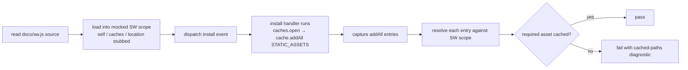

## Summary

The service worker's offline pre-cache guarantee was asserted by grepping
the *source* of `docs/sw.js` for quoted filename literals in two tests:

- `tests/csp-meta.test.js` (232–246) — `/["']\.\/sw-register\.js["']/`
  (and the same for `safe-error-banner.js`, `yahoo-validate.js`).
- `tests/yahoo-response-validation.test.ts` (433–442) —
  `/["']\.\/yahoo-validate\.js["']/`.

This is anti-pattern #2 (source-text greps used as assertions). The regex
matched the string anywhere in the file — a comment, a `console.log`, or a
`NETWORK_FIRST` entry would satisfy it — while building `STATIC_ASSETS`
from a manifest, spreading a constant, or computing the path would break
it with **no behavioural change**. The offline guarantee (WHAT — the asset
is actually cached on install) was never tested; only the presence of a
string in source (HOW).

Both tests are rewritten as behavioural WHAT-tests (suggested fix (a)).
Each loads `sw.js` into a mocked Service Worker scope, dispatches the real
`install` event with a stubbed Cache API, captures the entries handed to
`cache.addAll`, resolves them against the SW scope, and asserts an entry
resolves to each required asset. This exercises the offline-availability
guarantee itself and survives any refactor of how `STATIC_ASSETS` is
constructed. The harness mirrors the existing one in
`tests/sw-pathname-guards.test.ts` (Issue #43).

Closes #73.

## Evidence

Backend/test-only change — no web interface to screenshot.

Behaviour proven two ways:

1. **Pass on current `sw.js`** — `./quality.sh` reports `65 passed | 0 failed`.
2. **Fail when the guarantee breaks** — temporarily removing
   `"./yahoo-validate.js"` from `STATIC_ASSETS` makes both new tests fail
   with a message listing the assets actually cached, e.g.
   `cached: /app/, /app/index.html, /app/index.js, /app/safe-card.js,
   /app/safe-error-banner.js, /app/sw-register.js, ...` — confirming the
   tests inspect what is cached, not source text. The previous greps
   would still have passed on a refactor that kept the string but dropped
   the cache entry.

## Test Plan

- Rewrote `tests/csp-meta.test.js::docs/sw.js install handler pre-caches the
  offline helper assets` — asserts the install handler caches entries
  resolving to `sw-register.js`, `safe-error-banner.js`, and
  `yahoo-validate.js`.
- Rewrote `tests/yahoo-response-validation.test.ts::docs/sw.js install handler
  pre-caches yahoo-validate.js for offline use` — asserts the install
  handler caches an entry resolving to `yahoo-validate.js`.
- No existing tests were removed or commented out; the two source-grep
  assertions were replaced in place by behavioural equivalents.
- `./quality.sh < /dev/null` passes (`65 passed | 0 failed`); `deno fmt
  --check` and `deno lint` are clean on the modified TypeScript file.
