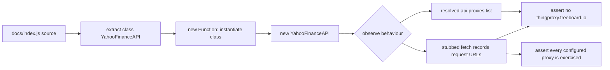

# Rewrite yahoo-proxy-allowlist tests as behavioural WHAT-tests

## Summary

`tests/yahoo-proxy-allowlist.test.js` previously regex-matched the literal
`this.proxies = [ … ]` array out of `docs/index.js` *source text* and asserted
on the extracted strings (anti-pattern #2 — source-text greps used as
assertions). Any behaviour-preserving refactor — building the list from
config/env, spreading a shared constant, renaming `proxies`, or changing quote
style — made the regex return `null`/empty and failed the tests even though the
resolved proxy set was unchanged. The `length >= 1` check also conflated "inline
string literals in source" with "operational proxies", and one case duplicated
another.

This PR replaces the three source-grep tests with behavioural WHAT-tests that
follow the repo's existing pattern (`tests/dark-mode-emoji.test.js`): the real
`YahooFinanceAPI` class is loaded out of `docs/index.js`, **instantiated**, and
its behaviour observed. With `fetch` stubbed, the tests assert on the request
URLs the unit actually issues — the observable outcome — so they survive any
reimplementation of how the proxy list is constructed and fail only on a real
regression that re-enables the abandoned `thingproxy.freeboard.io` proxy.

The unrelated CSP `connect-src` test is unchanged. No production code was
modified.

Closes #74.

## Evidence

This is a test-only change (no web interface to screenshot). Verified via:

- `./quality.sh < /dev/null` → **69 passed | 0 failed**, "[quality] All checks passed."
- TDD red check: temporarily reinstating `thingproxy.freeboard.io` in the
  resolved proxy list fails both the resolved-list assertion and the
  fetch-observation assertion (`pass 3 | fail 2`); removing it returns to
  `pass 5 | fail 0`. The old source-grep would only have failed on the literal
  text, not the behaviour.

## Test Plan

Rewritten / added in `tests/yahoo-proxy-allowlist.test.js`:

- **resolved proxy list omits thingproxy.freeboard.io** — instantiates the class
  and asserts no entry in the runtime `proxies` array targets the banned host.
- **keeps at least one operational proxy** — asserts the resolved list is
  non-empty (a real operational property, not a source-literal count).
- **never issues a request to thingproxy.freeboard.io** — stubs `fetch`, drives
  `validateFXPair()`, and asserts no issued request URL targets the banned host.
- **routes requests through every configured proxy** — asserts each configured
  proxy is actually exercised (guards against a vacuous pass where zero requests
  are issued).
- **CSP connect-src does not allow thingproxy.freeboard.io** — retained
  unchanged from the original suite.
