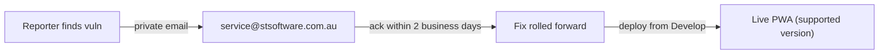

## Summary

Issue #77 asked for a GitHub-recognised `SECURITY.md` vulnerability
disclosure policy with three elements: a private reporting route, an
expected initial response time, and a supported-versions table.

A `SECURITY.md` already existed at the repository root (added by
issue #84) and already provided the **private reporting route**
(`service@stsoftware.com.au`) and the **expected response time** ("within
two business days"). The only missing element was the **supported-versions
table**.

This PR adds a "Supported versions" section that documents the project's
rolling-release model — the dashboard is a continuously deployed PWA with a
single live instance built from `Develop`, so the latest deployment is the
supported version and earlier cached builds are not. With this change all
three elements requested by the issue are present.

Closes #77.

## Evidence

This is a documentation/CLI change with no web interface to screenshot.
Verification is via the regression tests in `tests/security-md.test.js`,
all of which pass, plus the full quality gate:

```
✔ SECURITY.md states an expected initial response time
✔ SECURITY.md documents supported versions
✔ SECURITY.md supported-versions section includes a table
...
ok | 69 passed | 0 failed
[quality] All checks passed.
```

`markdownlint-cli2` reports 0 errors on `SECURITY.md`.



## Test Plan

Added three regression tests to `tests/security-md.test.js` (structural
assertions on the parsed document, not raw-byte greps):

- `SECURITY.md states an expected initial response time` — asserts a
  "N business days" acknowledgement timeframe is present.
- `SECURITY.md documents supported versions` — asserts a supported-versions
  H2 section exists.
- `SECURITY.md supported-versions section includes a table` — asserts a
  GitHub-flavoured markdown table is present.

The supported-versions tests failed before the `SECURITY.md` change and
pass after it. Existing issue-#84 tests remain unchanged and still pass.
