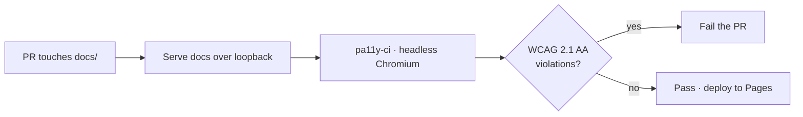

# PR Summary — Issue #78

## Summary

Wire an automated accessibility gate into CI for the PWA. Closes #78.

The dashboard ships a public-facing Progressive Web App (`docs/index.html`,
`docs/index.js`, `docs/styles.css`) but no automated accessibility check ran
in CI, so a11y regressions (missing labels, poor contrast, non-semantic
markup) were invisible to the test suite and only surfaced through manual
review. This PR adds a dedicated `Accessibility (pa11y)` workflow that runs
[`pa11y-ci`](https://github.com/pa11y/pa11y-ci) against the built static site
and fails the PR on any WCAG 2.1 AA violation before it reaches the live
Pages deploy.

A Node-based checker (installed via `npm install -g`) follows the existing
repo convention — `markdown-lint.yml` already installs the Node-only
`markdownlint-cli2` the same way — because no Deno-native a11y tool with a
headless browser exists to cover this need.

### Changes

- **`.github/workflows/accessibility.yml`** — new workflow. Serves `docs/`
  over loopback, waits for it to accept connections, then runs `pa11y-ci`
  against the WCAG 2.1 AA standard. Triggers on PRs/pushes to `Develop` that
  touch `docs/`. Third-party actions pinned to 40-character commit SHAs,
  `contents: read` least-privilege token, `timeout-minutes: 10`, and a
  cancel-superseded concurrency block — matching the repo's hardening posture.
- **`pa11yci.json`** — pa11y-ci config: WCAG2AA standard, `index.html` entry
  point, `--no-sandbox` Chromium args for the CI runner. Named without a
  leading dot so it stays outside the hidden-file commit blocklist.
- **`docs/styles.css`** — darkened the footer `#version` colour from
  `#6c757d` to `#5f666c`. Running the gate locally surfaced exactly one
  violation: the version text measured a 4.45:1 contrast ratio against the
  near-white background, just under the 4.5:1 AA threshold. `#5f666c` clears
  it with margin (≈5.8:1) so the gate passes at threshold 0 on the current
  site.
- **PWA version bump** `1.0.109` → `1.0.110` across `docs/index.js`,
  `docs/index.html`, `docs/sw.js`, `docs/sw-register.js` — required by the
  version-bump guard (issue #65) because an app-shell file changed.
- **`README.md`** — documented the new accessibility gate.

## Evidence

Ran `pa11y-ci` locally against the served `docs/` before and after the
contrast fix:

```text
# before
 > http://127.0.0.1/index.html - 1 errors
   • insufficient contrast 4.45:1 (need 4.5:1)  (#version)
✘ 0/1 URLs passed

# after
 > http://127.0.0.1/index.html - 0 errors
✔ 1/1 URLs passed
```

Footer after the contrast fix (now AA-compliant, version bumped to 1.0.110):


New CI flow:



## Test Plan

- Added `tests/accessibility-workflow.test.js` (8 cases). It parses the
  workflow into a structured object (per issue #42, not raw-text grep) and
  asserts: the file exists; expected name/triggers; `actions/checkout` and
  `actions/setup-node` pinned to 40-char SHAs; a pinned `pa11y-ci` is
  installed and run against `pa11yci.json`; a tight `timeout-minutes`;
  cancel-superseded concurrency; `contents: read` least privilege; and that
  `pa11yci.json` enforces WCAG2AA on the `index.html` entry point with
  `--no-sandbox`.
- `./quality.sh < /dev/null` passes (69 tests, Node + Deno), including the
  live version-consistency guard that confirms the `1.0.110` bump is
  mutually consistent across the app shell.
- `markdownlint-cli2` reports 0 errors.
- Verified the actual gate end-to-end locally: installed `pa11y-ci@3.1.0`,
  served `docs/`, and confirmed 1 → 0 errors across the contrast fix (above).
