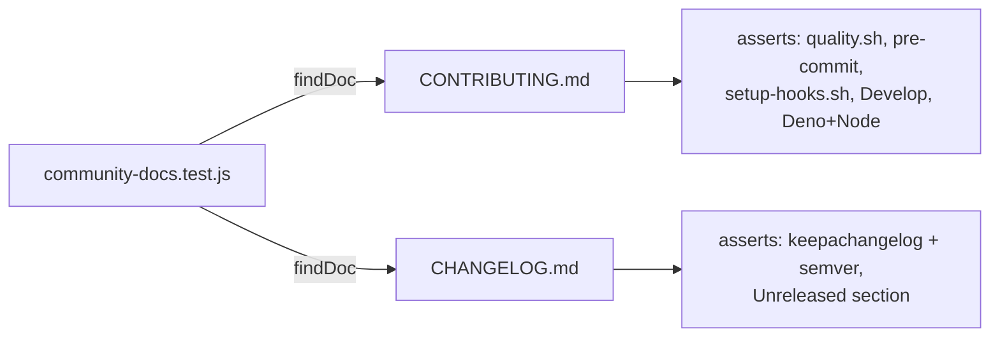

## Summary

Added the two standard community-health documents the repository was missing
(issue #79):

- **`CONTRIBUTING.md`** — consolidates the previously-scattered onboarding
  knowledge into one place: the Deno + Node toolchain, how to install the git
  hooks (`./setup-hooks.sh`), how to run the quality gate
  (`./quality.sh < /dev/null`), the `scripts/pre-commit` version-bump workflow,
  and the pull request process against the `Develop` base branch. Includes a
  Mermaid diagram of the auto version-bump flow.
- **`CHANGELOG.md`** — follows the [Keep a Changelog](https://keepachangelog.com/)
  format and [SemVer](https://semver.org/), seeded with an `## [Unreleased]`
  section recording this change.

Both are baseline open-source hygiene and were the only gap flagged by the
issue (a `README.md` already exists; the licence gap is tracked separately).

Closes #79.

## Evidence

This is a documentation/tooling change with no web interface to screenshot.
Verification is via the new test suite and the full quality gate.

The new tests parse each document into a small structural model (top-level
heading, H2 section titles) and assert on behaviour rather than raw text, so
reformatting will not break them:



Quality gate output:

```
ok | 69 passed | 0 failed (242ms)
[quality] All checks passed.
```

`markdownlint-cli2` on the new files: `0 error(s)`.

## Test Plan

- Added `tests/community-docs.test.js` (13 tests) — verifies CONTRIBUTING.md and
  CHANGELOG.md exist, have top-level headings, and contain the required content
  (quality gate, pre-commit hook, `setup-hooks.sh`, `Develop` base branch,
  Deno + Node toolchains for CONTRIBUTING; Keep a Changelog + SemVer references
  and an Unreleased section for CHANGELOG). Includes synthetic-data unit tests
  for the `topHeading`, `sectionTitles` and `hasSection` parser helpers.
- Added `tests/_community_docs.js` — the parser/locator helper module.
- Confirmed the tests fail before the documents were added (10 of 13 failing)
  and pass after (13 of 13), and that `./quality.sh < /dev/null` passes cleanly.
