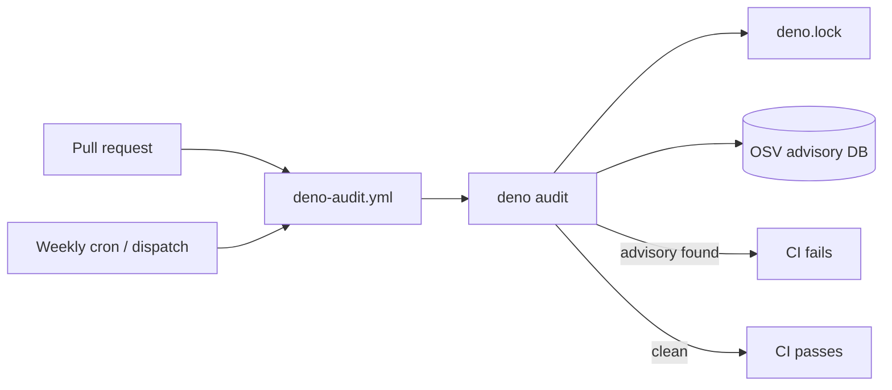

# PR Summary — SCR-VULN-SCAN: audit the full Deno dependency tree

## Summary

Closes #82.

CI previously ran SAST (`semgrep.yml`), secret scanning (`gitleaks.yml`)
and a diff-scoped `dependency-review-action` (`dependency-review.yml`),
but **nothing audited the full Deno dependency tree for known
advisories**. SAST analyses our own source, not our dependencies'
advisories; `dependency-review` only inspects dependencies added or
changed in a PR diff and relies on GitHub's dependency graph, which does
not parse Deno `deno.lock` / URL imports. The repository therefore had no
standing capability to learn that a dependency it already ships had
become vulnerable.

This PR adds a Deno-native advisory scan:

- **New workflow `.github/workflows/deno-audit.yml`** runs `deno audit`,
  which cross-references `deno.lock` against the OSV advisory database.
  It triggers on:
  - **`pull_request`** — catches a vulnerable dependency the moment it
    lands in a diff, and
  - **a weekly `schedule`** (Monday 07:00 UTC, staggered an hour after
    `deno-outdated.yml`) plus **`workflow_dispatch`** — catches a
    freshly-disclosed CVE in an existing, unchanged dependency without
    waiting for a PR. This closes the posture gap the audit flagged.
- Third-party actions are pinned to 40-character commit SHAs (matching
  the existing policy), permissions are `contents: read` only, the job is
  bounded by `timeout-minutes` and superseded runs are cancelled via a
  `concurrency` group — consistent with the other workflows in this repo.
- README updated to document the new audit alongside the existing CI
  scanners.

### Why a dedicated workflow (not just a step in `deno-quality.yml`)

The issue's key concern is detecting a CVE in an **unchanged** dependency
— which only a scheduled run catches. `deno-quality.yml` is
`pull_request`-only, so appending a step there would leave the standing
posture gap open. A dedicated workflow runs on both PRs and a weekly
schedule, covering both cases.

### Deno regression avoided

Used the Deno-native `deno audit` (OSV cross-reference of `deno.lock`)
rather than introducing a Node/third-party SCA tool (`npm audit`,
`osv-scanner`, Trivy), keeping the supply-chain scan within Deno's own
tooling.

## Evidence

This is a CI/workflow change with no web interface to screenshot.
Evidence is the local `deno audit` run and the workflow-structure tests.

`deno audit` against the current dependency tree:

```
$ deno audit
No known vulnerabilities found
(exit 0)
```



The scheduled trigger is what distinguishes this from
`dependency-review` (PR-diff-scoped) — it re-audits the **full** tree on a
cadence, so a CVE disclosed against an already-shipped dependency is
caught.

## Test Plan

Added `tests/deno-audit-workflow.test.js` (9 tests), following the
established `_workflow-yaml.js` structured-assertion pattern (no source
grepping). It parses `deno-audit.yml` into an object and asserts:

- the workflow file exists and declares the expected name;
- it triggers on `pull_request`, a **weekly** `schedule` (five-field cron
  with a pinned weekday) and `workflow_dispatch`;
- every third-party action is pinned to a 40-character commit SHA;
- `denoland/setup-deno` is pinned to `v2.x`;
- a step runs `deno audit`;
- permissions are `contents: read` with no write scope;
- the job runs on `ubuntu-latest` with a bounded `timeout-minutes`;
- superseded runs are cancelled via a `concurrency` group.

All checks pass via `./quality.sh` (Node suite 69 passed / 0 failed,
including the 9 new tests; Deno suite passes).
