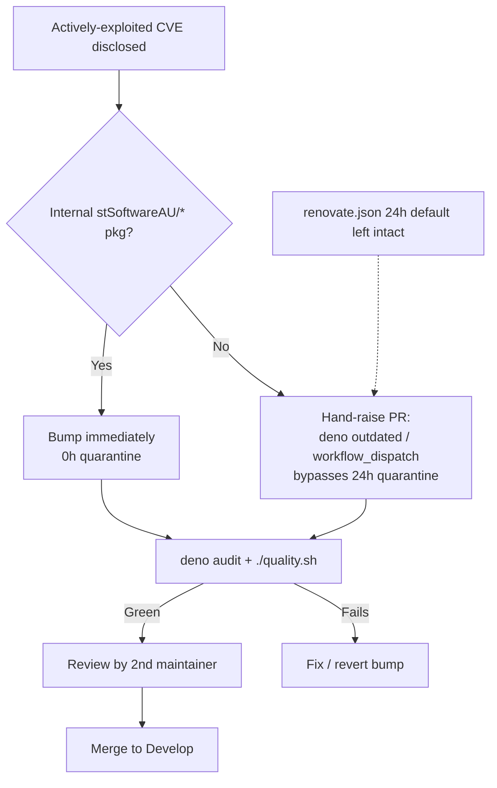

# Document the quarantine-override fast-lane (SCR-QUARANTINE-OVERRIDE)

## Summary

`renovate.json` imposes a 24-hour `minimumReleaseAge` quarantine on every
external dependency update, but `SECURITY.md` did not describe how to bypass
that window when a CVE is being **actively exploited** and a fix must land
immediately. The mechanism existed (manual `deno outdated` bumps and the
*Deno Dependency Updates* workflow's `workflow_dispatch`), but it was not
written down as the emergency procedure, so the team would have to improvise
under pressure — or, worse, disable the quarantine wholesale.

This PR documents the agreed fast-lane as a dedicated subsection of the
existing **Emergency-bump procedure** in `SECURITY.md`, and adds regression
tests that lock the documentation in place. Closes #85.

Key points of the documented override:

- A maintainer may **bypass the 24-hour quarantine** for an actively-exploited
  CVE by bumping the dependency by hand (`deno outdated --update <pkg>` or the
  *Deno Dependency Updates* workflow via `workflow_dispatch`) and opening a PR
  directly — Renovate's release-age gate only governs Renovate-raised PRs.
- The override **skips the waiting period, not the safety checks**: the PR must
  still pass `deno audit` and `./quality.sh` (including the `--frozen`
  `deno.lock` integrity check) and be **reviewed** by a second maintainer
  before merge.
- The quarantine default in `renovate.json` is left intact — the override is
  per-PR, never a config change.

## Evidence

Backend/documentation change — no web interface to screenshot. Verified via
the test suite (`node --test tests/security-md.test.js`) and the full quality
gate (`./quality.sh`), both green (69 passed, 0 failed). `markdownlint-cli2`
reports 0 errors on `SECURITY.md`.

The override path that the documentation now describes:

## Test Plan

Added five regression tests to `tests/security-md.test.js` (issue #85). The
first two fail against the pre-change `SECURITY.md` and pass after the update,
demonstrating the documentation gap they cover:

- `SECURITY.md frames the override around an actively-exploited CVE` — requires
  the document to mention an *exploited* CVE as the trigger.
- `SECURITY.md documents an explicit bypass of the 24-hour quarantine` —
  requires a bypass/override verb co-located with the quarantine noun, plus the
  24-hour window reference.
- `SECURITY.md names the workflow_dispatch manual-trigger override path`.
- `SECURITY.md keeps the audit + quality gate on the override path` — the
  fast-lane must still require `deno audit` and `./quality.sh`.
- `SECURITY.md requires review before merging an emergency bypass`.

The tests assert on the parsed/normalised document content (not raw bytes or
source greps for code symbols), matching the established pattern in
`tests/security-md.test.js`, so they survive reformatting but fail loudly if
the override guarantee is weakened or removed.
