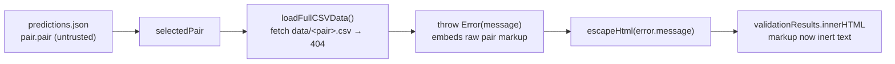

## Summary

Fixes an HTML-injection (DOM XSS, severity low) route in
`docs/index.js`. An untrusted FX pair name from `predictions.json` reached
`validationResults.innerHTML` (line ~2211) via a thrown error message:
`loadFullCSVData()` 404s for a markup-bearing pair and throws
`` Error(`Failed to load ${fxPair}.csv from data directory`) ``, whose
message was interpolated raw into the validation banner string.

The fix applies **contextual output encoding** at the sink — the same
XSS-defence invariant already used for `predictions.json` values via the
`textContent` builders in `safe-card.js` / `safe-error-banner.js`. A new
shared helper `docs/safe-html.js` exposes `globalThis.escapeHtml`, which
encodes the five HTML metacharacters. `validateHistoricalRanges()` now wraps
`error.message` in `escapeHtml(...)` so injected markup renders as inert text
rather than being parsed as HTML.

The page CSP already blocks scripted XSS (`script-src` without
`unsafe-inline`); this change closes the remaining HTML/CSS content-spoofing
vector on this route.

Closes #86.

### Data flow (before → after)

## Evidence

No visible UI change — this is a security hardening of an error path that
only triggers when a CSV fetch fails. Verified by automated tests rather
than a screenshot:

- New Deno test `tests/yahoo-validation-html-xss.test.ts` extracts the real
  `validateHistoricalRanges` method body, forces the CSV fetch to throw an
  error whose message embeds the exploit markup
  (`</small>
Spoofed
<small>`), and
  asserts the returned HTML string contains the **encoded** `&lt;div ...`
  and **no** raw `<div` / `</small><div` element. It also unit-tests
  `escapeHtml` directly and asserts `safe-html.js` loads before `index.js`.
- Full gate green: `./quality.sh` → `69 passed | 0 failed`.

App-shell version bumped `1.0.107` → `1.0.108` in lock-step (index.js
VERSION constant, index.html `?v=` query strings + version span, sw.js cache
names, sw-register.js) to bust PWA caches; `safe-html.js` added to the
service-worker precache list.

### Deno regression avoided

Implemented as a Deno-native classic-script helper + `deno test` coverage —
no Node tooling, bundler, or `package.json` introduced.

## Test Plan

- Added `tests/yahoo-validation-html-xss.test.ts`:
  - `escapeHtml encodes all five HTML metacharacters`
  - `escapeHtml coerces non-string input safely`
  - `validateHistoricalRanges encodes attacker markup from the error message`
    (regression for #86 — fails against the unfixed raw `${error.message}`)
  - `docs/index.html loads safe-html.js before index.js`
- Re-ran the full suite via `./quality.sh < /dev/null` — all 69 tests pass,
  including the pre-existing XSS, version-consistency, and SW-precache guards.
