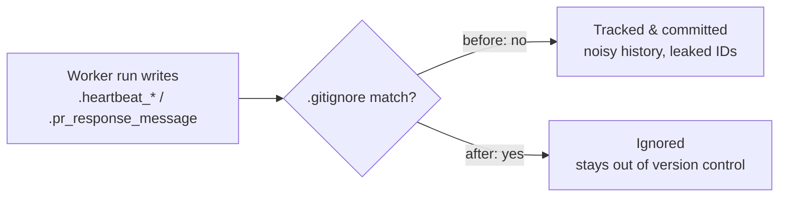

## Summary

Stop committing transient worker runtime-state files. Eight per-run heartbeat
artefacts plus a leftover PR-response draft were git-tracked at the repo root
(swept in alongside commit `baae3ce`). These churn history on every heartbeat,
produce noisy diffs and merge conflicts, and leak internal run identifiers
(comment IDs, worker indices) into the tree.

Changes:

- Added ignore patterns to `.gitignore`:
  - `.heartbeat_*`
  - `.heartbeat-marker_*`
  - `.pr_response_message`
- Untracked the committed copies with `git rm --cached` (the local files are
  left on disk but are now ignored).
- Added a regression test that asserts the patterns are git-ignored and that no
  such files remain tracked.

Closes #89.

## Evidence

Backend/repo-hygiene change with no web interface to screenshot. Verified via
the test suite and `git` behaviour:

- New test `tests/heartbeat-gitignore.test.js` failed before the fix (9 files
  tracked, patterns not ignored) and passes after.
- `git ls-files | grep -E '\.heartbeat|\.pr_response_message'` returns nothing
  after the change.
- `./quality.sh < /dev/null` → `ok | 69 passed | 0 failed`, `[quality] All checks passed.`

## Test Plan

- Added `tests/heartbeat-gitignore.test.js`:
  - `heartbeat and pr-response runtime files are git-ignored` — uses
    `git check-ignore -q` on sample paths for each pattern.
  - `no .heartbeat* or .pr_response_message files are tracked` — uses
    `git ls-files` and asserts no offenders remain.
- Re-ran the full gate `./quality.sh < /dev/null` — all 69 Node + Deno tests pass.
