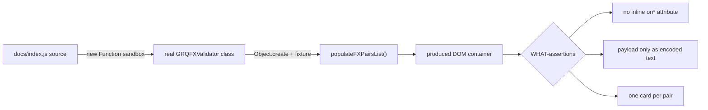

## Summary

Replaced the source-text-grep XSS regression test in `tests/fx-card-xss.test.ts`
with a behavioural WHAT-test that drives the real `populateFXPairsList` method
and asserts on the DOM it produces. Closes #91.

The old test (`"populateFXPairsList in docs/index.js uses the safe card
builder"`) read the source of `docs/index.js`, sliced out the method body, and
made two source-text assertions — that the body did **not** match
`/onclick="[^"]*\$\{pair\.pair\}/` and that it **did** include
`buildFXPairCard(`. This is a HOW-assertion (anti-pattern #1/#2): it tested how
the method is written, not what it renders. A behaviour-preserving refactor
(renaming the helper, building the handler via `addEventListener`, reformatting)
would break it even with no XSS regression, while a re-introduced vulnerability
through a differently-spelled sink would pass.

### What changed

- **Removed** the source-grep test and **added**
  `"populateFXPairsList renders pair names as encoded text with no inline
  handlers"`, which:
  - Evaluates the production `docs/index.js` source in a sandbox (via
    `new Function`), wiring the bare `document` / `window` / `buildFXPairCard`
    globals the module closes over to test doubles, and returns the real
    `GRQFXValidator` class.
  - Skips the constructor with `Object.create(prototype)` (so no network/DOM
    bootstrap runs) and invokes the **actual** `populateFXPairsList` against a
    fixture list containing a malicious pair name
    (``).
  - Asserts on the produced DOM: both pairs render a card, **no** rendered
    element carries an inline event-handler attribute (`on*`), the payload
    never appears as live `x</div>`;
```

makes the new test **fail**; reverting makes it pass.

```
populateFXPairsList renders pair names as encoded text with no inline handlers => FAILED   (regressed impl)
populateFXPairsList renders pair names as encoded text with no inline handlers ... ok       (real impl)
```



Full quality gate passes:

```
ok | 69 passed | 0 failed
[quality] All checks passed.
```

## Test Plan

- Modified `tests/fx-card-xss.test.ts`:
  - Removed the source-grep test `"populateFXPairsList in docs/index.js uses the
    safe card builder"`.
  - Added behavioural test `"populateFXPairsList renders pair names as encoded
    text with no inline handlers"` plus a `loadGRQFXValidator` harness.
  - Added `innerHTML` support to the mock node (and its `MockNode` interface).
- `./quality.sh < /dev/null` — 69 passed, 0 failed.
- Regression check: injected an inline-`onclick` `innerHTML` build into
  `populateFXPairsList` → new test fails; reverted → passes.
