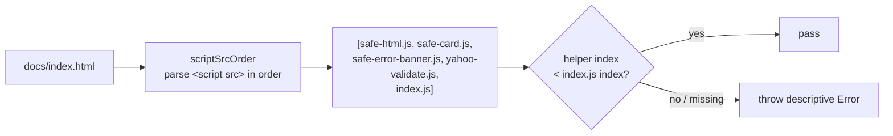

# Replace source-text grep load-order tests with WHAT-tests

## Summary

Two tests guarded the same behavioural guarantee — a helper script must load
(and therefore execute) before `index.js` — by grepping the **raw source** of
`docs/index.html` with `String.indexOf` and comparing byte offsets:

- `tests/yahoo-error-banner-xss.test.ts` — `safe-error-banner.js` vs `index.js?v=`
- `tests/yahoo-response-validation.test.ts` — `yahoo-validate.js` vs `index.js?v=`

That is anti-pattern #2 (source-text greps used as assertions): a HOW-assertion
on byte layout, not on the WHAT (execution order). It broke on
behaviour-preserving changes — changing the cache-busting query from `?v=` to
`?version=` or a content hash, reformatting the tags, or deferred/module loading
— and could be silently shifted by an unrelated earlier textual mention of
either filename. The load-order guarantee was never really exercised; only the
source-text layout was.

This PR rewrites both as WHAT-tests (suggestion **(a)** from the issue) sharing a
single helper, so the behavioural guarantee is asserted independently of the
version-query format. **Closes #92.**

## What changed

- **New `tests/helpers/script_order.ts`** — parses the actual `<script src>`
  elements of an HTML document in document (execution) order, reduces each `src`
  to a basename with any `?…`/`#…` query stripped, and exposes
  `assertScriptLoadsBefore(html, helper, app)`. Classic `<script src>` tags
  execute in document order, so element order is the real behavioural signal and
  is robust to the version-query format, tag reformatting, and unrelated textual
  mentions in comments/markup.
- **Both load-order tests** now call the shared helper against `docs/index.html`
  instead of comparing `indexOf` byte offsets.
- **New `tests/script-load-order.test.ts`** — unit tests for the parser/ordering,
  including version-format independence (`?v=`, `?version=`, no query) and the
  earlier-comment-mention case the old grep would have been fooled by.

## Out of scope (follow-up observation)

`tests/yahoo-validation-html-xss.test.ts` contains a third instance of the same
`indexOf` byte-offset pattern (`safe-html.js` vs `index.js?v=`). The issue's
finding (`BP-97680d942d19`) names only the two files above, so this PR leaves the
third untouched to respect scope — but the new `assertScriptLoadsBefore` helper
is ready to convert it in a follow-up.

## Evidence

CLI/test-only change — no web interface to screenshot. Verified via the test
suite: the rewritten tests still pass against the real `docs/index.html` (whose
order is `safe-html.js`, `safe-card.js`, `safe-error-banner.js`,
`yahoo-validate.js`, `index.js`), and the helper's own unit tests prove the new
assertion is independent of the version-query format and not fooled by an
earlier comment mention.

`./quality.sh` passes cleanly: **76 passed, 0 failed**.

## Test Plan

- Added `tests/script-load-order.test.ts`:
  - `scriptSrcOrder returns script basenames in document order`
  - `scriptSrcOrder strips any cache-busting query and path prefix`
  - `scriptSrcOrder handles multi-line tags and other attributes`
  - `assertScriptLoadsBefore passes when helper precedes app, any query format`
  - `assertScriptLoadsBefore throws when helper loads after app`
  - `assertScriptLoadsBefore throws when the helper script is absent`
  - `assertScriptLoadsBefore is not fooled by an earlier comment mention`
- Rewrote (kept the same test names, behavioural assertion preserved):
  - `tests/yahoo-error-banner-xss.test.ts::docs/index.html loads safe-error-banner.js before index.js`
  - `tests/yahoo-response-validation.test.ts::docs/index.html loads yahoo-validate.js before index.js`
