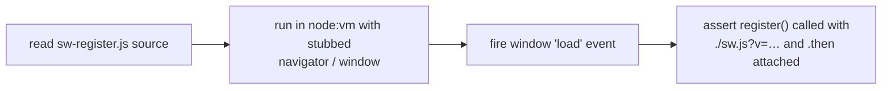

# PR Summary — Issue #93

## Summary

`tests/pwa-index-freshness.test.js` asserted behaviour by grepping the
**source text** of code modules (anti-pattern #2). Two cases were
rewritten as behavioural WHAT-tests so they observe runtime behaviour
instead of source layout and survive harmless refactors. Closes #93.

Changes:

- **`docs/sw-register.js` registration (was lines 95–103).** Replaced the
  `assert.match(swRegister, /navigator\.serviceWorker\.register\(…\)\.then\(/)`
  source grep with a real execution test. The module is now loaded into a
  `node:vm` context with a stubbed `navigator.serviceWorker`, `window`,
  `console` and `setInterval`. The test fires the `load` event and asserts
  that `register` was actually invoked with a versioned `./sw.js?v=…` URL
  and a `.then` fulfilment handler attached — exercising the registration
  behaviour directly. It now passes only when registration genuinely
  happens, and breaks if the URL or `.then` wiring regresses (not on
  reformatting). The `docs/index.html` reference check was split into its
  own focused test (it is a legitimate cross-file wiring assertion, not a
  behavioural grep).

- **`dispatchFetch(` grep (was lines 73–79).** Dropped the
  `assert.ok(/dispatchFetch\s*\(/.test(src), …)` grep of the sibling
  *test file's* source. A substring's presence does not prove the suite
  dispatches anything; the real signal is `sw-pathname-guards.test.ts`
  running green in the Deno gate. Kept only the reasonable `existsSync`
  anti-deletion guard so a careless `git rm` cannot silently drop runtime
  coverage.

No production code changed — `docs/sw-register.js` behaviour is unchanged.

## Evidence

Backend/test-only change — no web UI to screenshot.

### Behavioural verification

The rewritten `sw-register.js` test was confirmed to be a true WHAT-test:
temporarily breaking the registration URL (`./sw.js?v=1.0.110` →
`./worker.js`) made the test **fail**, and restoring it made it **pass** —
proving it observes behaviour, not source text.

### Quality gate

`./quality.sh < /dev/null` passes cleanly:

- Node suite: `tests/pwa-index-freshness.test.js` — 5 tests pass.
- Deno suite: `76 passed | 0 failed`.

## Test Plan

In `tests/pwa-index-freshness.test.js`:

- **Added** `` `docs/sw-register.js` registers ./sw.js?v=… and attaches a
  .then handler `` — loads the module in a mocked scope and asserts the
  registration call and URL (verified to fail on a broken URL).
- **Added** `` `docs/index.html` references the extracted sw-register.js
  script `` — split out the cross-file wiring check.
- **Changed** the service-worker-suite test to keep only the `existsSync`
  anti-deletion guard, removing the `dispatchFetch(` source grep.
