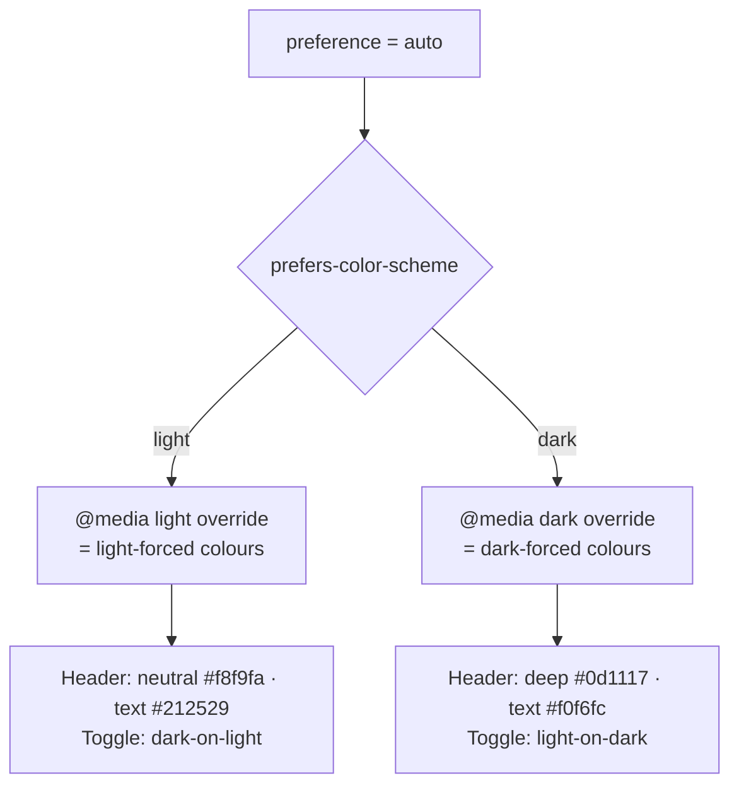

# Auto theme now follows the OS (Issue #96)

## Summary

The theme toggle has three states — **Light**, **Dark** and **Auto**. "Auto"
is meant to follow the operating system: render the light theme when the OS is
light and the dark theme when the OS is dark. It did not. In **auto + system-light**
the header kept a brand-purple gradient and the toggle stayed translucent-white,
so the dashboard rendered a *third* look that matched neither the light nor the
dark theme — the exact complaint in this issue.

The root cause was a deliberate divergence added in issues #44/#67: the header
and `#dark-mode-toggle` had `@media (prefers-color-scheme: dark)` overrides for
auto + dark, but **no** counterpart for auto + light, so auto + light fell
through to the brand-purple base rule. The fix adds the symmetric
`@media (prefers-color-scheme: light)` overrides (guarded by
`body:not(.dark-mode-forced):not(.light-mode-forced)`) so that when the OS is
light and no theme is forced, the header and toggle mirror the
`body.light-mode-forced` colours exactly.

Net effect: **auto now renders pixel-identical to the matching forced theme** in
both directions — `auto + OS-light == light-forced`, `auto + OS-dark == dark-forced`.

Closes #96.

## Evidence

Playwright MCP / a headless browser were not available in this environment, so
visual proof is provided via the repository's own computed-cascade resolver
(`tests/_css_cascade.js`) — the same WHAT-test approach the theme suite already
uses. It resolves the declaration that actually **wins** the cascade for each
element in each theme state. After the fix:

| State            | Header background                  | Header text | Toggle background        | Toggle text |
| ---------------- | ---------------------------------- | ----------- | ------------------------ | ----------- |
| forced-light     | `#f8f9fa → #e9ecef` gradient       | `#212529`   | `rgba(255,255,255,0.9)`  | `#212529`   |
| **auto + light** | `#f8f9fa → #e9ecef` gradient       | `#212529`   | `rgba(255,255,255,0.9)`  | `#212529`   |
| forced-dark      | `#0d1117 → #161b22` gradient       | `#f0f6fc`   | `rgba(0,0,0,0.6)`        | `#f0f6fc`   |
| **auto + dark**  | `#0d1117 → #161b22` gradient       | `#f0f6fc`   | `rgba(0,0,0,0.6)`        | `#f0f6fc`   |

The two auto rows are now identical to the matching forced rows. Before the fix,
**auto + light** resolved the header to
`linear-gradient(var(--primary-color), var(--secondary-color))` (purple) and the
toggle to `rgba(255,255,255,0.1)` / white — the divergence the issue screenshot
shows.

### Deno regression avoided

This is a Deno repo. The fix is pure CSS + the existing `node --test` /
`deno test` suites — no Node-only tooling, bundler, or browser dependency was
introduced to render or screenshot the change; the existing Deno/Node cascade
resolver supplies the rendered-colour evidence instead.

## Test Plan

- **New** `tests/auto-theme-mirrors-forced.test.js` (7 tests) — asserts the auto
  header and toggle resolve to the **same** colours as the matching forced theme
  for both a light and a dark OS, and that auto + light no longer keeps the
  purple identity. These failed before the CSS change and pass after.
- **Extended** `tests/_css_cascade.js` — the shared resolver now understands
  `@media (prefers-color-scheme: light)` (a `light` media frame that matches only
  when the OS is light), backward-compatible with existing `dark`/`other` frames.
- **Updated (documented business-logic change for #96)** three existing tests
  that asserted the old "auto + light keeps purple/translucent-white" behaviour
  to assert the new "auto mirrors light-forced" behaviour:
  `tests/header-theme.test.js`, `tests/heading-theme-cascade.test.js`,
  `tests/theme-toggle-styling.test.js`. No tests were removed or commented out.
- Full gate green: `./quality.sh` → 179 Node tests + 69 Deno tests pass.
- Version bumped `1.0.108 → 1.0.109` across `index.js`, `index.html`, `sw.js`,
  `sw-register.js` so cached PWA clients pick up the new stylesheet.
