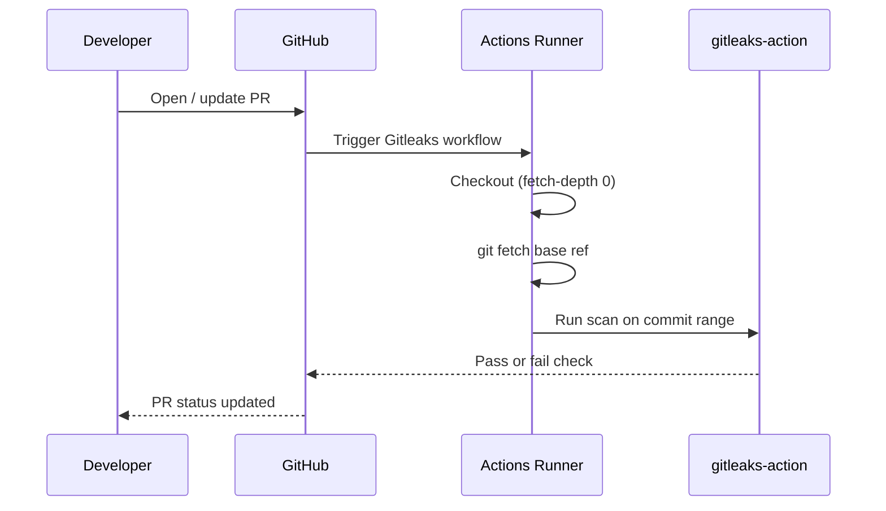

## Summary

Added a Gitleaks Secrets Detection GitHub Actions workflow at
`.github/workflows/gitleaks.yml` so every pull request is scanned for
accidentally committed credentials before merge. Mirrors the canonical
NEAT-AI pattern and pins third-party actions to 40-character commit
SHAs to defend against supply-chain attacks. Closes #1.

## Evidence

This is a CI-only change with no web interface to screenshot. Behaviour
is verified by unit tests that assert the workflow YAML's structure,
triggers, permissions, action pinning, base-ref fetch, and secret
wiring.

Test output (new tests only):

```
✔ gitleaks workflow file exists
✔ gitleaks workflow declares the expected name and triggers
✔ gitleaks workflow uses pinned commit SHA for actions/checkout
✔ gitleaks workflow checks out the full history (fetch-depth: 0)
✔ gitleaks workflow fetches the PR base branch before scanning
✔ gitleaks workflow uses pinned commit SHA for gitleaks-action
✔ gitleaks workflow uses least-privilege permissions
✔ gitleaks workflow wires GITHUB_TOKEN and GITLEAKS_LICENSE via env
ℹ tests 8  ℹ pass 8  ℹ fail 0
```

Workflow sequence on a pull request:



## Test Plan

- Added `tests/gitleaks-workflow.test.js` with 8 assertions covering:
  - File presence
  - Workflow name and `pull_request` trigger
  - 40-char SHA pinning for `actions/checkout` and `gitleaks/gitleaks-action`
  - `fetch-depth: 0` on checkout
  - `git fetch origin "<base_ref>:<base_ref>"` step
  - Least-privilege `contents: read` permissions
  - `GITHUB_TOKEN` and `GITLEAKS_LICENSE` env wiring
- All 8 new tests pass under `node --test`.
- Two unrelated PWA service-worker tests are pre-existing failures on
  the base branch and are not affected by this change.
