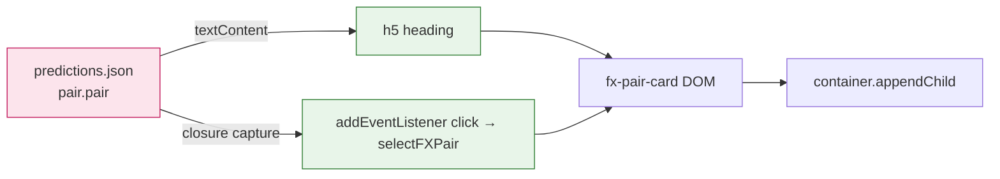

## Summary

Hardens the FX-pair card builder against DOM-based XSS. The previous
`populateFXPairsList()` in `docs/index.js` string-concatenated `pair.pair`
(loaded from `<date>/predictions.json`, controlled by PR contributors)
directly into an `innerHTML` template and into an inline `onclick=`
attribute. A crafted value such as `');alert(document.cookie);//` would
have escaped the JS string in the attribute and run attacker JavaScript
in every visitor's browser after the PR was merged. **Closes #12.**

The fix moves card construction into a new `docs/safe-card.js` helper that
builds every node with `document.createElement` and assigns user-controlled
values via `textContent`. The click handler is bound with
`addEventListener`, so the pair name is captured in a closure and never
flows through HTML or JS-string parsing.

## Evidence

The change is a backend/DOM hardening: the visible card layout is
unchanged. Verified locally by:

1. Running the new Deno test suite (`tests/fx-card-xss.test.ts`) with a
   malicious `pair.pair` payload — `5 passed | 0 failed`.
2. Serving `docs/` via `helpers/server.ts` and confirming both
   `safe-card.js` (HTTP 200) and `index.html` (HTTP 200) load.

Previously `pair.pair` flowed into `innerHTML` (HTML-parsed) and into an
inline `onclick="...('${pair.pair}')"` attribute (JS-string-parsed); both
sinks are now eliminated.

## Test Plan

New tests in `tests/fx-card-xss.test.ts`:

- `buildFXPairCard does not emit an inline onclick attribute` — guards the
  attribute-injection sink described in the issue.
- `buildFXPairCard renders the pair name only as encoded text` — feeds in
  `` and asserts it never appears as raw HTML.
- `buildFXPairCard click handler receives the literal pair name` —
  asserts the exploit payload arrives at `selectFXPair` as a string, not
  as parsed JavaScript.
- `buildFXPairCard places the pair name as h5 textContent` — feeds in
  `` and asserts the `<h5>` `textContent` equals
  the raw payload (so it cannot be parsed as a `<script>` element).
- `populateFXPairsList in docs/index.js uses the safe card builder` —
  regression guard against the unsafe `onclick="…('${pair.pair}')"`
  pattern coming back.

Other changes:

- `docs/index.html`: loads `safe-card.js` before `index.js`.
- `docs/sw.js`: precaches `safe-card.js` so the PWA serves the matched
  pair at any version.
- `scripts/pre-commit`: bumps the `safe-card.js?v=` cache buster alongside
  the existing `index.js?v=` bump.
