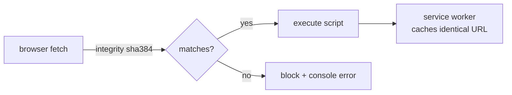

## Summary

Pins every `cdn.jsdelivr.net` asset loaded by the dashboard to a
specific version and adds `integrity="sha384-…"` + `crossorigin="anonymous"`
to every `<script>` and `<link>` so a malicious release of `chart.js`,
`chartjs-adapter-date-fns`, or `bootstrap` (or a CDN/edge compromise)
cannot inject arbitrary JavaScript into visitors' browsers. Also aligns
Bootstrap CSS and JS to the same version (`5.3.3`) — previously
`5.3.0` CSS and `5.1.3` JS were mismatched. The service worker's
`STATIC_ASSETS` list is updated to the same pinned URLs so the
integrity-validated payload is what gets cached offline.
**Closes #13.**

## Evidence

Dashboard rendered after the SRI pinning — Bootstrap, Chart.js and the
date adapter all loaded successfully under integrity validation, no
SRI failures in the page console:

Verified via Playwright (`/tmp/sri-screenshot.mjs` headless Chromium
run): `typeof window.Chart === "function"`,
`typeof window.bootstrap === "object"`, and `0` console / pageerror /
requestfailed events. SRI hashes were computed locally with
`openssl dgst -sha384 -binary | openssl base64 -A` against the exact
pinned URLs.

| Asset | Pinned URL | sha384 (truncated) |
| --- | --- | --- |
| Bootstrap CSS | `bootstrap@5.3.3/dist/css/bootstrap.min.css` | `QWTKZyjp…ALEwIH` |
| Bootstrap JS | `bootstrap@5.3.3/dist/js/bootstrap.bundle.min.js` | `YvpcrYf0…6jIeHz` |
| Chart.js | `chart.js@4.5.0/dist/chart.umd.min.js` | `XcdcwHqI…XLcA6Y` |
| Date adapter | `chartjs-adapter-date-fns@3.0.0/dist/chartjs-adapter-date-fns.bundle.min.js` | `cVMg8E3Q…b1mxws` |

## Test Plan

New tests in `tests/cdn-sri-pins.test.js` (`node --test`):

- `docs/index.html loads at least four assets from jsdelivr` — guard
  in case future edits collapse or remove the CDN block.
- `every jsdelivr asset in index.html pins a specific @version` —
  rejects the bare-package form (`/npm/chart.js`) the issue called
  out.
- `every jsdelivr asset in index.html has integrity=sha384-... and crossorigin=anonymous`
  — fails closed if a future contributor adds a `<script>` without SRI.
- `Bootstrap CSS and Bootstrap JS use the same major.minor.patch version`
  — regression guard for the 5.3.0 / 5.1.3 mismatch the issue called out.
- `chart.js URL in index.html is pinned to a specific version` and
  `chartjs-adapter-date-fns URL in index.html is pinned to a specific version`
  — explicit per-package guards.
- `docs/sw.js STATIC_ASSETS CDN URLs match the pinned URLs in index.html`
  — ensures the service worker pre-cache cannot drift to an unpinned
  payload and lock a poisoned response into every installed PWA.

Other files touched:

- `docs/index.html` — pinned URLs + SRI attributes on the four CDN
  tags; Bootstrap unified at 5.3.3.
- `docs/sw.js` — `STATIC_ASSETS` updated to the same pinned URLs (the
  existing `CACHE_NAME` bump on every commit, via
  `scripts/pre-commit`, refreshes the offline cache).
