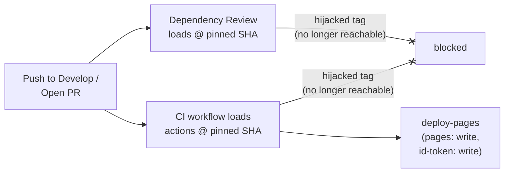

## Summary

Pinned every third-party GitHub Action referenced from `.github/workflows/ci.yml`
and `.github/workflows/dependency-review.yml` to a 40-character commit SHA so
a hijacked floating tag cannot exfiltrate CI secrets, mint OIDC tokens, or
publish arbitrary content to the production GitHub Pages site via the
`deploy-pages` job (which holds `pages: write` and `id-token: write`).
Closes #14.

The version each SHA corresponds to is recorded in a `# action@vX.Y.Z`
comment immediately above each `uses:` line, matching the convention already
used by `gitleaks.yml`, `markdown-lint.yml`, `semgrep.yml`, and
`shellcheck.yml`.

| Action | Previous | Pinned SHA | Tag |
| --- | --- | --- | --- |
| `actions/checkout` | `@v4` | `34e114876b0b11c390a56381ad16ebd13914f8d5` | v4.3.1 |
| `actions/configure-pages` | `@v4` | `1f0c5cde4bc74cd7e1254d0cb4de8d49e9068c7d` | v4 |
| `actions/upload-pages-artifact` | `@v3` | `56afc609e74202658d3ffba0e8f6dda462b719fa` | v3 |
| `actions/deploy-pages` | `@v4` | `d6db90164ac5ed86f2b6aed7e0febac5b3c0c03e` | v4 |
| `actions/dependency-review-action` | `@v4` | `2031cfc080254a8a887f58cffee85186f0e49e48` | v4.9.0 |

## Evidence

This is a CI/workflow security hardening change — there is no UI to
screenshot. The behaviour is verified by the new regression tests
described below. All 14 workflow-pinning assertions pass (`node --test
tests/ci-workflow.test.js tests/dependency-review-workflow.test.js`).



Two pre-existing failures in `tests/pwa-index-freshness.test.js` (service
worker `predictions.json` handling) are unrelated to this change and were
present before the branch.

## Test Plan

- Added `tests/ci-workflow.test.js` — verifies `ci.yml` exists, declares
  the expected name and trigger, pins `actions/checkout`,
  `actions/configure-pages`, `actions/upload-pages-artifact`, and
  `actions/deploy-pages` to 40-character SHAs, contains no floating-tag
  `uses:` references, and still grants `pages: write` and `id-token: write`
  to the deploy job (so the elevated permissions called out in the issue
  cannot silently regress).
- Added `tests/dependency-review-workflow.test.js` — verifies
  `dependency-review.yml` exists, declares the expected name and trigger,
  pins `actions/checkout` and `actions/dependency-review-action` to
  40-character SHAs, contains no floating-tag `uses:` references, and
  uses `contents: read` least-privilege permissions.
- Both test files follow the same `node:test` pattern as
  `tests/gitleaks-workflow.test.js` so the regression-test coverage is
  consistent across all six workflows.
- Verified the new tests fail against the unpinned `@v4` / `@v3`
  references before the fix and pass after.

Run locally:

```bash
node --test tests/ci-workflow.test.js tests/dependency-review-workflow.test.js
```
