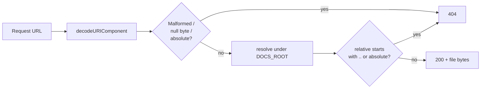

## Summary

Hardened `helpers/server.ts` against path traversal. Every request URL is
now resolved against an absolute `DOCS_ROOT` and rejected (404) if the
resolved path escapes the `docs/` sandbox — covering `..` segments,
URL-encoded `%2e%2e%2f`, absolute paths, malformed percent-encoding, and
null-byte injection. The server also binds explicitly to `127.0.0.1` so
older Deno releases (<1.35, where the default was `0.0.0.0`) cannot
expose the dev server to the LAN. Closes #15.

## Evidence

Backend/CLI change — no UI to screenshot. Verified end-to-end against a
live server:

```
$ deno run --allow-net --allow-read helpers/server.ts 8765
$ curl --path-as-is 'http://127.0.0.1:8765/../helpers/server.ts'  # → 404
$ curl 'http://127.0.0.1:8765/%2e%2e/helpers/server.ts'           # → 404
$ curl 'http://127.0.0.1:8765/'                                   # → 200
$ lsof -i -P -n | grep 8765
deno  …  TCP 127.0.0.1:8765 (LISTEN)                              # loopback only
```

Request-handling flow after the fix:



## Test Plan

Added `tests/server-path-traversal.test.ts` (10 tests, all passing):

- `getFilePath - root URL maps to docs/index.html`
- `getFilePath - empty path maps to docs/index.html`
- `getFilePath - docs/ prefix is stripped`
- `getFilePath - nested data file resolves under docs`
- `getFilePath - rejects parent-directory traversal`
- `getFilePath - rejects URL-encoded parent-directory traversal`
- `getFilePath - rejects absolute paths`
- `getFilePath - rejects null-byte injection`
- `getFilePath - resolved path is contained within DOCS_ROOT`
- `server.ts source binds explicitly to 127.0.0.1`

Run with:

```bash
deno test --allow-read tests/server-path-traversal.test.ts < /dev/null
```
