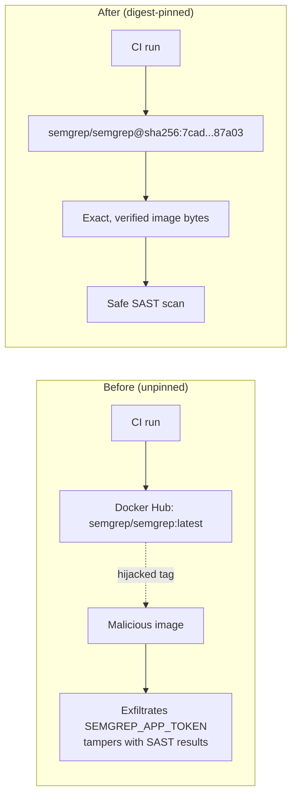

# Pin semgrep/semgrep container image to sha256 digest

## Summary

`.github/workflows/semgrep.yml` declared its job container as
`semgrep/semgrep` with no tag, so the runner pulled `semgrep/semgrep:latest`
and trusted whatever Docker Hub currently served. A hijacked `:latest`
tag (registry account takeover, malicious release, registry MITM on a
self-hosted runner) would execute inside CI with access to
`SEMGREP_APP_TOKEN` and the PR diff — the same threat the workflow
already defends against for `actions/checkout` by pinning to a 40-char
commit SHA.

Pinned the container to
`semgrep/semgrep:1.163.0@sha256:7cad2bc2d1e44f87f0bf4be6d1fa23aa90fb72015bebc89fb91385d813987a03`
(the latest stable Semgrep release, pushed 2026-05-13 — past the 24h
external-dependency quarantine). Added a comment naming the bump
procedure so the next bumper knows to update both the human-readable
tag and the digest from Docker Hub.

Closes #16.

## Evidence

This is a CI/workflow change with no UI surface to screenshot.

Verification:

- Added regression test `semgrep container image is pinned to a sha256 digest (issue #16)`
  in `tests/semgrep-workflow.test.js`. It asserts the image reference
  contains an `@sha256:<64-hex>` digest **and** that the bare
  `image: semgrep/semgrep` (implicit `:latest`) pattern is absent.
- Test fails against the unfixed workflow:

  ```text
  ✖ semgrep container image is pinned to a sha256 digest (issue #16)
    AssertionError: semgrep container image must be pinned to a sha256 digest
  ```

- Test passes after the workflow change. All 7 semgrep-workflow tests
  pass:

  ```text
  ℹ tests 7
  ℹ pass 7
  ℹ fail 0
  ```

Threat model before and after the change:



## Test Plan

- Added `tests/semgrep-workflow.test.js::semgrep container image is pinned to a sha256 digest (issue #16)`.
  Verifies the container image reference contains an `@sha256:<64-hex>`
  digest and forbids the bare unpinned form.
- All existing tests in `tests/semgrep-workflow.test.js` continue to
  pass (workflow name, triggers, `actions/checkout` pin, semgrep
  invocation, least-privilege permissions, `SEMGREP_APP_TOKEN` wiring).
- Full repository test run: only two pre-existing service-worker test
  failures remain (`pwa-index-freshness.test.js`, unrelated to this
  change — confirmed by re-running on the unmodified base).
