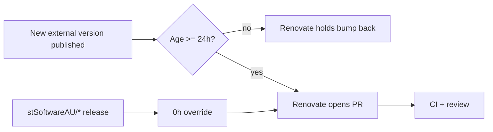

## Summary

Added a `renovate.json` at the repository root that enforces a 24-hour
supply-chain quarantine on every external dependency before it can be
bumped. The repo previously had no Renovate, no Dependabot, and no
`bump-deps.sh`, so a freshly-published (and therefore not-yet-flagged)
version of any GitHub Action, Deno std import, or CDN-loaded browser
library could have landed instantly. Closes #17.

The quarantine covers all three ecosystems flagged in the audit:

- GitHub Actions referenced from `.github/workflows/*.yml` (handled by
  Renovate's built-in `github-actions` manager, plus an explicit
  `matchManagers` rule for defence in depth).
- The Deno standard library imported from `helpers/server.ts` (handled
  by a `customManagers` regex that matches
  `https://deno.land/std@<version>/...`).
- CDN-loaded browser libraries (Bootstrap, Chart.js, the chart.js
  date-fns adapter) referenced from `docs/index.html` and `docs/sw.js`
  (handled by a `customManagers` regex covering `jsdelivr`, `cdnjs`,
  and `unpkg`).

Internal `stSoftwareAU/*` packages are explicitly exempted via a
`packageRules` override so they continue to update immediately.

## Evidence

This is a configuration / supply-chain change with no UI or
performance impact. Verification was through a new regression test
suite (`tests/renovate-quarantine.test.js`) that loads the JSON
config directly and asserts on its parsed structure:

```text
ℹ tests 9
ℹ pass 9
ℹ fail 0
```

Two pre-existing failures in `tests/pwa-index-freshness.test.js` were
confirmed to exist on `Develop` before this change and are unrelated.



## Test Plan

- Added `tests/renovate-quarantine.test.js` with 9 tests covering:
  - `renovate.json` exists, parses as JSON, and declares the Renovate
    `$schema`.
  - Top-level `minimumReleaseAge` is >= 24 hours.
  - `stSoftwareAU/*` packages have an explicit `0 hours` override.
  - `github-actions` manager is not disabled.
  - A `customManagers` entry targets `https://deno.land/std` imports.
  - A `customManagers` entry targets CDN-loaded browser libraries.
  - The `github-actions` quarantine is enforced either at the top
    level or via a per-manager rule (defence in depth).
- Ran `node --test tests/renovate-quarantine.test.js` — all 9 pass.
- Confirmed the file is valid JSON and the `$schema` URL matches the
  official Renovate schema so Renovate Bot can pick it up on its next
  scan.
